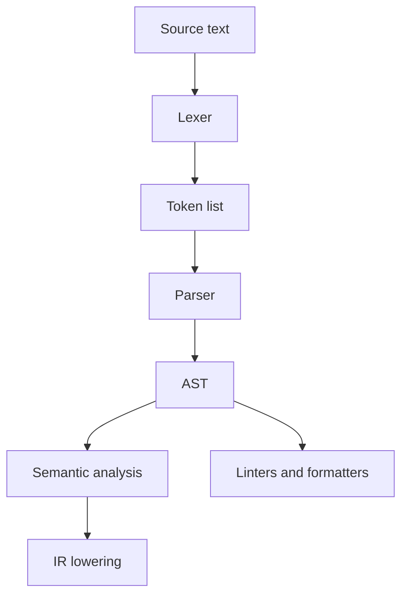

import { ConceptTemplate } from '@/features/kb/components/templates/ConceptTemplate'
import { Callout } from '@/features/kb/components/mdx/Callout'
import { ComparisonTable } from '@/features/kb/components/mdx/ComparisonTable'

export default function Layout({ children }) {
  return (
    <ConceptTemplate title="Abstract Syntax Tree (AST)">
      {children}
    </ConceptTemplate>
  )
}

The **abstract syntax tree** is the first structure that actually understands your program. A lexer emits a flat token list. A parser folds that list into nodes for declarations, expressions, and statements. Parentheses, commas, and most keywords exist only to guide the parse; once the tree is built, the hierarchy itself encodes precedence and nesting.

## 1. Deep Dive and Mechanics

Each node is a typed record: a BinaryExpression holds an operator plus left and right children; a FunctionDecl holds a name, parameters, and a body block. Tools walk the tree with a visitor or a recursive walk. Compilers lower the AST into IR. Linters and formatters stop at the AST and rewrite it.

**Abstract versus concrete.** A concrete syntax tree keeps every token, including comments and parens. An AST drops what does not affect meaning. Source maps and pretty-printers sometimes keep extra spans so they can reprint the original file faithfully.

**Why the tree matters.** Constant folding, type checking, and rename-refactor all need parent and sibling context. A token stream cannot tell you whether an identifier is a type, a field, or a local without a scope walk on a tree.

<Callout icon="tip" title="Why it is called abstract">
The tree is abstract because it throws away syntax that only exists for humans and the parser. After 5 + (10 * 2) is parsed, the parens are gone; the nested multiply node already forces the right evaluation order.
</Callout>

## 2. Mathematical / Theoretical Foundation

An AST is a term over a ranked signature: each production of the context-free grammar becomes a constructor. For a grammar with expression productions E -> E + T | T, the corresponding terms are Plus(e, t) and the term for T. Evaluation is a homomorphism from terms to values: interpret children, then apply the operator.

Tree walks are structural recursion. Post-order evaluation matches the compositional semantics of most expression languages. Attribute grammars decorate each node with inherited and synthesized attributes (types, liveness, constant values).

<ComparisonTable
  headers={['Structure', 'Keeps punctuation', 'Primary consumer', 'Typical cost']}
  rows={[
    ['Token stream', 'Yes, as tokens', 'Parser', 'Linear scan'],
    ['Concrete syntax tree', 'Yes', 'Formatters, IDEs', 'Large, faithful'],
    ['Abstract syntax tree', 'No', 'Type checkers, compilers', 'Compact, semantic'],
    ['IR / SSA', 'No', 'Optimisers, codegen', 'Machine-oriented'],
  ]}
/>

## 3. Real-World Implementation

```python
class Node:
    pass

class Lit(Node):
    def __init__(self, value):
        self.value = value

class Add(Node):
    def __init__(self, left, right):
        self.left = left
        self.right = right

def eval_ast(node):
    if isinstance(node, Lit):
        return node.value
    if isinstance(node, Add):
        return eval_ast(node.left) + eval_ast(node.right)
    raise TypeError('unknown node')

# 5 + (10 * 2) would be Add(Lit(5), Mul(Lit(10), Lit(2)))
print(eval_ast(Add(Lit(5), Lit(15))))
```

Production front ends (clang, rustc, TypeScript) attach source spans to every node so diagnostics can underline the original text.

## 4. Visualizations



## 5. Interview Prep

**Q: AST versus parse tree?**
**A:** A parse tree mirrors the grammar, including unit productions and punctuation. An AST keeps only nodes that carry meaning and is what later passes consume.

**Q: Why not interpret tokens directly?**
**A:** Precedence, nesting, and name binding are hierarchical. A flat list cannot represent that without re-parsing on every use.

**Q: How do source maps relate?**
**A:** Each AST node stores a span. After transforms, maps send generated positions back to those spans so debuggers and error messages still point at user code.

## 6. Production Use Cases

- **Language servers** (gopls, rust-analyzer, tsserver) keep a typed AST per open file for hover, rename, and completion.
- **ESLint and clang-tidy** pattern-match AST nodes instead of regex on source.
- **Transpilers** (TypeScript, Babel, javac) rewrite or lower ASTs before emit.

<Callout icon="info" title="Pretty-print needs more than an AST">
If you must reprint comments and original wrapping, keep trivia on the concrete tree or attach comment tokens to nearby AST nodes.
</Callout>
