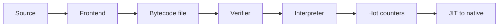

import { ConceptTemplate } from '@/features/kb/components/templates/ConceptTemplate'
import { Callout } from '@/features/kb/components/mdx/Callout'
import { ComparisonTable } from '@/features/kb/components/mdx/ComparisonTable'

export default function Layout({ children }) {
  return (
    <ConceptTemplate title="Bytecode Design">
      {children}
    </ConceptTemplate>
  )
}

**Bytecode** is a compact instruction set invented for a language runtime rather than for a CPU. The compiler emits load-const, add, call, and jump opcodes. A virtual machine interprets them, or a JIT later turns hot traces into native code. Java class files, CPython pyc, CIL, and WASM are all bytecode designs with different trade-offs.

## 1. Deep Dive and Mechanics

Two dominant models exist. A **stack machine** pushes operands, then an opcode pops them (JVM, CPython, WASM). A **register machine** names virtual registers in each instruction (Lua 5.0, Dalvik, many JS engines internally). Stack code is dense and easy to emit. Register code often needs fewer instructions and maps more cleanly onto hardware.

**Encoding.** Fixed-width opcodes are simple to decode. Variable-width encodings save space for common loads. Immediate operands may be inlined or stored in a constant pool. Exception tables and debug line maps sit beside the instruction stream.

**Verification.** Safe VMs type-check the bytecode before run: stack height is consistent on every path, locals have known types, jumps land on instruction boundaries. That is how the JVM can sandbox untrusted class files.

<Callout icon="warning" title="Opcode space is a compatibility contract">
Renumbering an opcode breaks every file already shipped. Reserve gaps, version the header, and never reuse a retired code while old artifacts still exist.
</Callout>

## 2. Mathematical / Theoretical Foundation

Bytecode is a small ISA. Its operational semantics is a transition relation on a machine state (pc, stack or registers, heap). Stack machines correspond to postfix evaluation of expression trees. Register machines correspond to three-address code.

Verification is a dataflow problem: abstract interpret each block to compute stack types and local types; reject if two predecessors disagree or if an opcode sees the wrong sort of value. Sound verification implies the interpreter never has to check those properties again at run time.

<ComparisonTable
  headers={['Design', 'Operand style', 'Density', 'Example']}
  rows={[
    ['Stack bytecode', 'Implicit stack', 'High', 'JVM, CPython, WASM'],
    ['Register bytecode', 'Explicit vregs', 'Lower', 'Lua, Dalvik'],
    ['Threaded code', 'Word addresses', 'Medium', 'Forth, some Forth-like VMs'],
    ['Native ISA', 'Hardware regs', 'Lowest portable', 'x86-64, AArch64'],
  ]}
/>

## 3. Real-World Implementation

```python
# Tiny stack bytecode: LOAD_CONST, ADD, PRINT, HALT
LOAD_CONST, ADD, PRINT, HALT = range(4)

def run(code, consts):
    stack = []
    pc = 0
    while True:
        op = code[pc]
        pc += 1
        if op == LOAD_CONST:
            stack.append(consts[code[pc]])
            pc += 1
        elif op == ADD:
            b = stack.pop()
            a = stack.pop()
            stack.append(a + b)
        elif op == PRINT:
            print(stack.pop())
        elif op == HALT:
            return

# print(1 + 2)
run([LOAD_CONST, 0, LOAD_CONST, 1, ADD, PRINT, HALT], [1, 2])
```

Real designs add CALL with a frame, JUMP_IF_FALSE, and a constant pool shared by many functions.

## 4. Visualizations



## 5. Interview Prep

**Q: Stack versus register bytecode?**
**A:** Stack is easier to generate and denser. Register usually executes fewer opcodes and is a better JIT input. Many modern engines parse stack bytecode then lower to an SSA register form internally.

**Q: Why verify?**
**A:** So the runtime can omit per-opcode type and bounds checks that would otherwise dominate interpreted performance, and so untrusted code cannot smash the interpreter frame.

**Q: Is WASM a bytecode?**
**A:** Yes: a portable, verified stack ISA with structured control flow, designed as a compilation target rather than a human programming language.

## 6. Production Use Cases

- **JVM and CLR** ship verified bytecode as the stable deploy artifact.
- **CPython and CPython alternatives** cache pyc so import does not reparse.
- **Game and plugin sandboxes** interpret a small bytecode instead of loading native DLLs.

<Callout icon="tip" title="Design for the JIT, not only the interpreter">
If a JIT is in the roadmap, keep opcodes close to SSA-friendly operations and avoid hidden side effects on every load.
</Callout>
