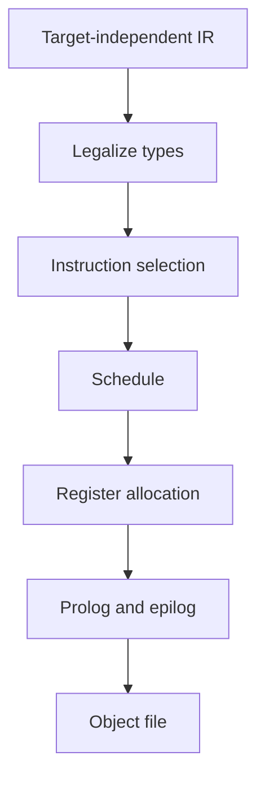

import { ConceptTemplate } from '@/features/kb/components/templates/ConceptTemplate'
import { Callout } from '@/features/kb/components/mdx/Callout'
import { ComparisonTable } from '@/features/kb/components/mdx/ComparisonTable'

export default function Layout({ children }) {
  return (
    <ConceptTemplate title="Code Generation">
      {children}
    </ConceptTemplate>
  )
}

**Code generation** is where a compiler stops being language-shaped and becomes machine-shaped. IR values become instructions. Virtual registers become physical ones. Calls become the platform ABI: who owns which register, how the stack is aligned, how a struct returns. The output is usually an object file the linker can consume.

## 1. Deep Dive and Mechanics

Three classic subproblems dominate.

**Instruction selection.** Pattern-match IR trees or DAGs onto the target ISA. LLVM uses SelectionDAG and GlobalISel. A plus of two i32 values becomes addl or add w-register depending on the triple.

**Instruction scheduling.** Reorder the selected instructions to hide latency and respect issue width, without breaking data dependences.

**Register allocation.** Infinite SSA names must fit in a handful of physical registers. Graph coloring and linear scan are the usual algorithms. Spills go to the stack frame.

The backend also lowers legalization (i64 on a 32-bit target), peephole opts, prolog/epilog insertion, and debug-info emission.

<Callout icon="warning" title="Wrong ABI is a heisenbug">
If the caller and callee disagree on who saves r12 or how a 16-byte struct is passed, you get stack corruption that appears only on one platform. Codegen must match the platform SysV, MS, or AAPCS document exactly.
</Callout>

## 2. Mathematical / Theoretical Foundation

Instruction selection can be stated as tiling: cover the IR DAG with tiles that each correspond to a legal instruction, minimizing a cost (latency or size). Optimal tiling on trees is DP; on DAGs it is harder and compilers use greedy or ILP-inspired heuristics.

Register allocation: interference graph vertices are live ranges; edges mean "cannot share a register." Chromatic number bounded by available registers is NP-hard in general. SSA form makes some interference graphs chordal, which is why SSA-based allocators are popular.

<ComparisonTable
  headers={['Phase', 'Input', 'Output', 'Hard part']}
  rows={[
    ['ISel', 'IR', 'Target instrs, vregs', 'Odd ISA patterns'],
    ['Schedule', 'Instr list', 'Reordered list', 'Latency vs regs'],
    ['Regalloc', 'vregs', 'pregs + spills', 'Spill placement'],
    ['Emit', 'Machine IR', 'Object / asm', 'Relocs, CFI, debug'],
  ]}
/>

## 3. Real-World Implementation

```python
# Toy three-address lowering: a = b + c  ->  load, add, store
def codegen_add(dst, lhs, rhs, regs):
    asm = []
    asm.append(f'ldr r0, {lhs}')
    asm.append(f'ldr r1, {rhs}')
    asm.append('add r0, r0, r1')
    asm.append(f'str r0, {dst}')
    return asm
```

A real backend would keep b and c in registers if they are already live, and would pick add versus lea versus lea+scale on x86.

## 4. Visualizations



## 5. Interview Prep

**Q: Why not emit assembly from the AST?**
**A:** You would reimplement optimisation, legalization, and ABI lowering for every language. IR plus a shared backend is how LLVM and GCC scale to many languages and CPUs.

**Q: What is a spill?**
**A:** A value that does not fit in a register is written to the stack and reloaded later. Spills are the usual reason "more SSA names" can make a function slower.

**Q: Fast-ISel versus SelectionDAG?**
**A:** Fast-ISel covers common IR quickly for -O0. SelectionDAG or GlobalISel does the expensive pattern matching at -O2.

## 6. Production Use Cases

- **AOT compilers** (clang, rustc, javac+HotSpot is mixed) emit native or JIT later.
- **JIT backends** (LLVM ORC, Cranelift, JVM C2) run a lighter codegen under a time budget.
- **GPU compilers** (NVCC, ROCm, Metal) generate ISA for a different machine model: warps, shared memory, no classic stack.

<Callout icon="tip" title="Look at the assembly">
godbolt.org is the fastest way to learn codegen. Change -O2 to -O0 and watch register allocation and inlining disappear.
</Callout>
