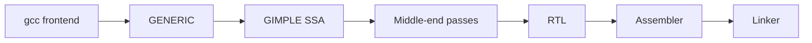

import { ConceptTemplate } from '@/features/kb/components/templates/ConceptTemplate'
import { Callout } from '@/features/kb/components/mdx/Callout'
import { ComparisonTable } from '@/features/kb/components/mdx/ComparisonTable'

export default function Layout({ children }) {
  return (
    <ConceptTemplate title="GNU Compiler Collection (GCC)">
      {children}
    </ConceptTemplate>
  )
}

**GCC** is the GNU Compiler Collection: a family of frontends sharing a middle end and many machine backends. It is still the system compiler on most Linux distributions, the compiler that builds the Linux kernel on many architectures, and the reference for a long list of GNU language extensions.

## 1. Deep Dive and Mechanics

Each frontend (C, C++, Ada, Fortran, D, Go historically, and others) produces **GENERIC**, then **GIMPLE**. GIMPLE is a three-address IR. The middle end runs SSA-based passes: inlining, constant propagation, vectorization, loop opts. The backend lowers to **RTL** (Register Transfer Language), a lisp-like representation close to the machine, then allocates registers and emits assembly.

**Driver.** gcc and g++ are drivers. They expand -march, call cc1 or cc1plus, then as and ld (or the gold/lld you configured). Spec files describe that pipeline.

**Extensions.** Nested functions, statement expressions, and many attributes are GNU-isms. Code that compiles only with GCC is a portability risk; code that uses __builtin_* often has a Clang twin.

<Callout icon="info" title="GCC and LLVM are peers, not clones">
They implement the same languages and similar opts, but the IRs, pass managers, and plugin APIs differ. A GCC plugin will not load into Clang.
</Callout>

## 2. Mathematical / Theoretical Foundation

GIMPLE-SSA is a sparse SSA form. Classic dataflow (reaching definitions, liveness) becomes almost constant-time on SSA. RTL is closer to a machine-level rewriting system: each insn is a pattern with constraints that the register allocator and reload pass must satisfy.

Link-time optimisation (LTO) serializes GIMPLE into object files so the middle end can see the whole program at link time — the same idea as LLVM ThinLTO, different file format.

<ComparisonTable
  headers={['IR', 'Level', 'Used for', 'Audience']}
  rows={[
    ['GENERIC', 'AST-like', 'Frontend lowering', 'GCC internals'],
    ['GIMPLE', 'Three-address SSA', 'Most opts', 'Middle end'],
    ['RTL', 'Machine-ish', 'ISel, regalloc, emit', 'Backends'],
    ['LLVM IR', 'SSA, typed', 'clang/rustc/swift', 'LLVM world'],
  ]}
/>

## 3. Real-World Implementation

```bash
gcc -O2 -march=native -c app.c -o app.o
gcc -O2 -flto -o app app.o util.o
g++ -std=c++20 -Wall -Wextra -Werror main.cpp

# Ask GCC what it would do
gcc -Q --help=optimizers
gcc -S -O2 -fverbose-asm app.c
```

Kernel builds pass a carefully pinned set of -fno-* flags; do not casually raise -O3 on the kernel.

## 4. Visualizations



## 5. Interview Prep

**Q: When would you pick GCC over Clang?**
**A:** Targets Clang does not support well, a distro that standardizes on GCC, kernel or firmware trees that assume GNU extensions, or a measured codegen win on that CPU.

**Q: What is RTL?**
**A:** GCC's last IR before assembly: insn patterns with predicates and constraints. Backend authors spend most of their time on RTL machine descriptions.

**Q: GCC LTO versus fat LTO objects?**
**A:** Slim LTO objects hold bytecode-like GIMPLE. Fat objects hold both GIMPLE and normal code so non-LTO links still work, at a size cost.

## 6. Production Use Cases

- **Linux distro package builds** and the kernel on x86, ARM, Power, RISC-V, s390.
- **Embedded and cross toolchains** (arm-none-eabi-gcc) where GCC has decades of target coverage.
- **HPC Fortran** stacks that still treat gfortran as the default.

<Callout icon="warning" title="Do not mix -fPIC and unusual TLS models casually">
ABI flags (-fPIC, -fno-plt, -mregparm, TLS models) must match across every object in the link, including static libraries you did not compile today.
</Callout>
