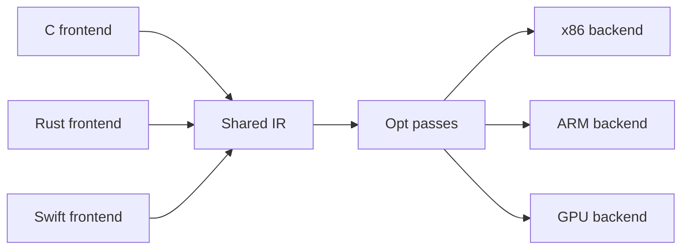

import { ConceptTemplate } from '@/features/kb/components/templates/ConceptTemplate'
import { Callout } from '@/features/kb/components/mdx/Callout'
import { ComparisonTable } from '@/features/kb/components/mdx/ComparisonTable'

export default function Layout({ children }) {
  return (
    <ConceptTemplate title="Intermediate Representation (IR)">
      {children}
    </ConceptTemplate>
  )
}

An **intermediate representation** is a program form designed for machines that write compilers, not for humans who write apps. Frontends lower language-specific ASTs into IR. Optimisers rewrite IR. Backends select instructions from IR. LLVM IR, GCC GIMPLE, Java bytecode, and WASM are all IRs at different distances from the metal.

## 1. Deep Dive and Mechanics

Good IR is **explicit**. Control flow is a graph of basic blocks, not nested source statements. Names are infinite virtual registers, not memory, until a later pass. Side effects are modeled (memory, calls, traps) so a pass can move code only when it is safe.

**SSA form.** Each name is assigned once. Phi nodes merge values at control-flow joins. SSA makes reaching definitions trivial and is the default for LLVM and GIMPLE.

**Levels.** High-level IR still has objects and virtual calls (Java bytecode, Swift SIL). Mid-level IR has typed pointers or typed memory and a small instruction set (LLVM IR). Low-level IR is almost the machine (SelectionDAG, GCC RTL, MachineIR).

<Callout icon="tip" title="IR is a product API">
If you publish bitcode (LLVM, Swift, WASM), the IR schema is a compatibility surface. Version it. Do not silently change poison or wrap semantics.
</Callout>

## 2. Mathematical / Theoretical Foundation

A basic-block CFG is a directed graph; dominance and post-dominance are partial orders used by SSA construction (Cytron et al.) and by placing invariants. SSA is a sparse representation of the use-def chain.

Many opts are monotone dataflow frameworks: a lattice, a transfer function per instruction, a merge at joins. SSA plus a sparse propagator (SCCP) is the same math with fewer vertices.

<ComparisonTable
  headers={['IR', 'SSA', 'Typed', 'Typical home']}
  rows={[
    ['Three-address code', 'Optional', 'Sometimes', 'Textbooks, early GCC'],
    ['LLVM IR', 'Yes', 'Yes', 'clang, rustc, Swift'],
    ['GIMPLE', 'Yes', 'Yes', 'GCC middle end'],
    ['Bytecode / WASM', 'No / structured', 'Verified', 'VMs, portable deploy'],
  ]}
/>

## 3. Real-World Implementation

```llvm
; LLVM IR for  return a + b;  in a function
define i32 @add(i32 %a, i32 %b) {
entry:
  %sum = add nsw i32 %a, %b
  ret i32 %sum
}
```

nsw means "no signed wrap" so the optimiser may assume overflow is undefined, matching C.

## 4. Visualizations



## 5. Interview Prep

**Q: Why not optimise the AST?**
**A:** ASTs are language-shaped, full of nested scopes and implicit conversions. IR makes control flow and data flow uniform so one inliner and one GVN serve every frontend.

**Q: What does SSA buy you?**
**A:** Unique assignments, simple use-def, and cheaper constant prop and dead-code elim. The cost is phi insertion and an extra lowering step before the register allocator.

**Q: Is bytecode an IR?**
**A:** Yes, a portable one. It may be too low or too stack-ish for some opts, so JITs first lift bytecode into SSA IR.

## 6. Production Use Cases

- **Multi-language toolchains** (LLVM, Graal) share opts across frontends.
- **LTO / ThinLTO** persist IR into object files for whole-program opts at link time.
- **MLIR** stacks domain dialects (linalg, gpu) above LLVM IR in ML compilers.

<Callout icon="info" title="Read the language reference">
LLVM LangRef defines poison, undef, and wrap flags. Most "the optimiser ate my code" bugs are a frontend that promised more than the source language allowed.
</Callout>
