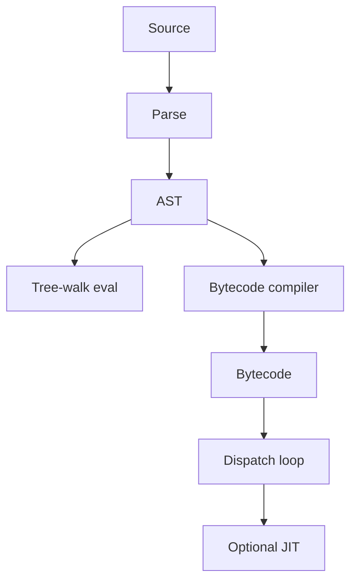

import { ConceptTemplate } from '@/features/kb/components/templates/ConceptTemplate'
import { Callout } from '@/features/kb/components/mdx/Callout'
import { ComparisonTable } from '@/features/kb/components/mdx/ComparisonTable'

export default function Layout({ children }) {
  return (
    <ConceptTemplate title="Interpreters">
      {children}
    </ConceptTemplate>
  )
}

An **interpreter** executes a program without first producing a standalone native binary. It may walk the AST (tree-walk), decode bytecode (CPython, early JVM), or mix both. The edit-run loop is short, the implementation is portable, and the same runtime can offer a REPL, reflection, and rich errors. The cost is dispatch overhead and missed native opts.

## 1. Deep Dive and Mechanics

**Tree-walk.** After parse, eval(node) recurses. Fine for calculators, config languages, and teaching. Every node is a call and a type switch.

**Bytecode interpreter.** The compiler produces opcodes. A loop fetches the next opcode and jumps to a handler (switch, computed goto, or threaded code). Locals live in a frame array. This is CPython, Ruby YARV, and many game scripting VMs.

**Dispatch styles.** A C switch is simple. Threaded code stores the address of the next handler and jumps, cutting branch-predictor misses. Superinstructions fuse common pairs (load + add).

Many production "interpreters" are staged: interpret until a hotness counter trips, then JIT.

<Callout icon="info" title="Interpretation is a spectrum">
A shell is an interpreter. So is the JVM at -Xint. So is a CPU microcode engine. The useful distinction is whether your deploy artifact is source/bytecode plus a runtime, or a native image.
</Callout>

## 2. Mathematical / Theoretical Foundation

An interpreter is an operational semantics made executable: a relation (state, next-state) implemented as a loop. For an expression language, denotational eval is a fold over the AST. For bytecode, the semantics is a small-step machine.

Performance: dispatch plus boxing often costs 10x to 100x versus AOT. Big-O of the algorithm is unchanged; the constant factor is the problem. Specializing interpreters (PyPy's approach, Futamura projections) generate a compiler from an interpreter.

<ComparisonTable
  headers={['Style', 'Input', 'Speed', 'Good for']}
  rows={[
    ['Tree-walk', 'AST', 'Slowest', 'DSLs, teaching'],
    ['Bytecode loop', 'Opcodes', 'Moderate', 'CPython, Ruby'],
    ['JIT companion', 'Hot bytecode', 'Fast hot paths', 'JVM, V8, LuaJIT'],
    ['AOT native', 'Object code', 'Fast from t0', 'C, Rust, Go'],
  ]}
/>

## 3. Real-World Implementation

```python
def interpret(node, env):
    kind = node[0]
    if kind == 'num':
        return node[1]
    if kind == 'var':
        return env[node[1]]
    if kind == 'add':
        return interpret(node[1], env) + interpret(node[2], env)
    if kind == 'let':
        name, value, body = node[1], node[2], node[3]
        child = dict(env)
        child[name] = interpret(value, env)
        return interpret(body, child)
    raise ValueError(kind)

# let x = 10 in x + 2
prog = ('let', 'x', ('num', 10), ('add', ('var', 'x'), ('num', 2)))
print(interpret(prog, {}))
```

## 4. Visualizations



## 5. Interview Prep

**Q: Interpreter versus compiler?**
**A:** A compiler translates ahead of time to another form (IR, bytecode, native). An interpreter executes that form or the AST. Most language implementations do both.

**Q: Why is CPython still interpreted?**
**A:** Portability, a simple C API for extensions, and "fast enough" for the glue that calls NumPy. Hot numeric work leaves the interpreter. A JIT exists in other Pythons (PyPy) and is arriving in CPython incrementally.

**Q: What is a closure in an interpreter?**
**A:** A function value that captures the environment it was created in. Implementation is a pair (code, env) or upvalues that outlive the stack frame.

## 6. Production Use Cases

- **Dynamic languages** (Python, Ruby, JS before JIT warmup, PHP).
- **Config and policy engines** (Rego, CEL, many game Lua VMs).
- **Database engines** interpret query plans as trees of iterators.

<Callout icon="warning" title="Do not eval untrusted source">
An interpreter that exposes the host language is a remote-code-execution primitive. Sandbox, capability-restrict, or do not take user strings.
</Callout>
