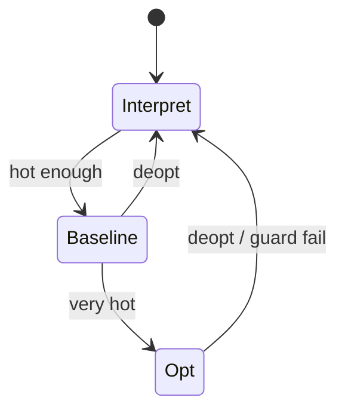

import { ConceptTemplate } from '@/features/kb/components/templates/ConceptTemplate'
import { Callout } from '@/features/kb/components/mdx/Callout'
import { ComparisonTable } from '@/features/kb/components/mdx/ComparisonTable'

export default function Layout({ children }) {
  return (
    <ConceptTemplate title="Just-In-Time (JIT) Compilation">
      {children}
    </ConceptTemplate>
  )
}

**JIT compilation** produces native code while the program runs. The runtime starts in an interpreter or a cheap compiler, counts executions, and when a function or loop is hot, compiles a specialised native version. Java HotSpot, V8, .NET RyuJIT, LuaJIT, and PyPy all live on this idea.

## 1. Deep Dive and Mechanics

**Method JIT.** Compile a whole function once it is hot (HotSpot C1/C2, .NET). **Tracing JIT.** Record a hot loop path and compile that linear trace (LuaJIT, older TraceMonkey). **Baseline then optimising.** V8's Ignition interpreter plus TurboFan; HotSpot's C1 then C2.

**Speculation.** The JIT assumes "this add is two Smi integers" or "this call hits one receiver class." It plants a guard. If the guard fails, it **deoptimises**: jump back to the interpreter and maybe recompile later with less optimism.

**Code cache.** Native blobs live in an executable region with a size cap. GC must relocate or invalidate code that inlines a class that was unloaded.

<Callout icon="warning" title="Warmup is part of the SLA">
The first thousand requests can be 10x slower than steady state. For latency SLOs, warmup the JIT in a pre-prod ritual or use AOT/PGO profiles (Graal Native, .NET ReadyToRun, Java CDS/AOT).
</Callout>

## 2. Mathematical / Theoretical Foundation

A JIT is a partial evaluator with a profile. Futamura's first projection: specialise an interpreter with respect to a program, get a compiler. Tracing is specialising along one path of the CFG.

Guards split the concrete state space. Each compiled version is valid on a subset. Deopt is a soundness mechanism: when the subset is left, discard the compiled theorem.

Tiered compilation is an optimisation under a time budget: spend compile time only where the expected remaining executions repay it.

<ComparisonTable
  headers={['Engine', 'Start', 'Hot compiler', 'Deopt']}
  rows={[
    ['HotSpot', 'Interpreter / C1', 'C2 or Graal', 'Yes, uncommon traps'],
    ['V8', 'Ignition', 'TurboFan / Maglev', 'Yes'],
    ['LuaJIT', 'Interpreter', 'Trace recorder', 'Yes, trace abort'],
    ['CPython 3.13+', 'Bytecode', 'Copy-and-patch tiers', 'Limited'],
  ]}
/>

## 3. Real-World Implementation

```python
# Conceptual hotness + compile threshold (not a real JIT)
THRESHOLD = 1000
hits = {}
native = {}

def call(fn_id, interpret, compile_fn, args):
    hits[fn_id] = hits.get(fn_id, 0) + 1
    compiled = native.get(fn_id)
    if compiled is not None:
        return compiled(*args)
    if hits[fn_id] >= THRESHOLD:
        native[fn_id] = compile_fn(fn_id)
        return native[fn_id](*args)
    return interpret(*args)
```

Real JITs compile off-thread, patch call sites, and keep a deopt metadata table.

## 4. Visualizations



## 5. Interview Prep

**Q: JIT versus AOT?**
**A:** AOT pays compile cost before run and cannot see live types. JIT sees profiles and monomorphic call sites, but needs warmup, a code cache, and a more complex runtime.

**Q: What is a megamorphic call site?**
**A:** A call that has seen many receiver types. Inline caches stop helping; the JIT emits a full dispatch. That is a common JS and Java slow path.

**Q: Why can JIT code be faster than static C?**
**A:** It rarely beats carefully written C on a stable numeric kernel. It can beat generic C++ on megamorphic-looking source that is monomorphic at run time, because it specialises. Do not claim this as a universal win.

## 6. Production Use Cases

- **JVM and CLR services** that run for hours and repay warmup.
- **Browsers** (V8, SpiderMonkey, JavaScriptCore) JITing JS and WASM.
- **Game scripting** with LuaJIT where scripts stay hot in a frame loop.

<Callout icon="tip" title="Measure after warmup">
Benchmarks that include JIT compile time lie about steady state. Run a warmup loop, then time, or use JMH/.NET BenchmarkDotNet.
</Callout>
