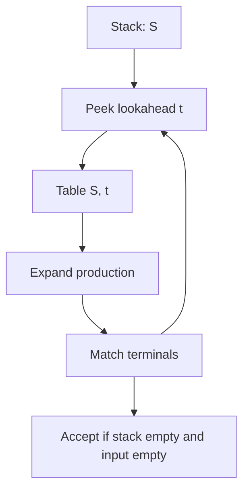

import { ConceptTemplate } from '@/features/kb/components/templates/ConceptTemplate'
import { Callout } from '@/features/kb/components/mdx/Callout'
import { ComparisonTable } from '@/features/kb/components/mdx/ComparisonTable'

export default function Layout({ children }) {
  return (
    <ConceptTemplate title="LL Parsing (Top-Down)">
      {children}
    </ConceptTemplate>
  )
}

**LL parsing** reads the input Left-to-right and builds a Leftmost derivation. The parser starts at the start symbol and repeatedly expands the leftmost nonterminal. An **LL(k)** parser looks at most k tokens ahead to pick which production to use. LL(1) is the sweet spot taught in courses and used by many hand-written and generated top-down parsers.

## 1. Deep Dive and Mechanics

The parser holds a stack of grammar symbols, or equivalently a call stack in recursive descent. When the top is a terminal, it must match the next token. When the top is a nonterminal A, it peeks at the lookahead, consults a table T[A, token], and pushes that production's right-hand side (in reverse, if using an explicit stack).

**Conflicts.** Two productions of A both viable for the same lookahead: FIRST/FIRST conflict. A nullable production colliding with FOLLOW: FIRST/FOLLOW conflict. Left recursion (A -> A alpha) never terminates in a naive LL parser.

**Pragmatics.** ANTLR's adaptive LL(*) walks the input with a graph-structured lookahead when LL(1) is not enough. PEG parsers also go top-down but use ordered choice, which is a different contract than a CFG.

<Callout icon="warning" title="Ban left recursion or rewrite it">
A -> A + T | T loops forever in LL. Rewrite to T (+ T)* or use a Pratt/precedence climber for expressions. LR parsers accept left recursion naturally.
</Callout>

## 2. Mathematical / Theoretical Foundation

FIRST(alpha) is the set of terminals that can begin a string derived from alpha, plus epsilon if alpha can derive empty. FOLLOW(A) is the set of terminals that can appear immediately after A in some sentential form.

A grammar is LL(1) iff for every pair of productions A -> alpha | beta, FIRST(alpha) and FIRST(beta) are disjoint, and if alpha is nullable then FIRST(beta) is disjoint from FOLLOW(A). The parse table then has at most one production per cell.

<ComparisonTable
  headers={['Family', 'Derivation', 'Left recursion', 'Lookahead', 'Typical tool']}
  rows={[
    ['LL(1)', 'Leftmost', 'Must rewrite', '1 token', 'Hand RD, many textbooks'],
    ['LL(k) / LL(*)', 'Leftmost', 'Must rewrite', 'k or unbounded', 'ANTLR'],
    ['LR(1) / LALR', 'Rightmost reversed', 'OK', '1 token', 'yacc, bison, lalrpop'],
    ['PEG', 'Top-down ordered', 'Usually banned', 'Unlimited packrat', 'peg.js, pest'],
  ]}
/>

## 3. Real-World Implementation

```python
# LL(1)-style recursive descent for  T = id | '(' E ')'
# E = T ('+' T)*
def parse_T(toks, i):
    if toks[i] == 'id':
        return i + 1
    if toks[i] == '(':
        i = parse_E(toks, i + 1)
        if toks[i] != ')':
            raise SyntaxError('expected )')
        return i + 1
    raise SyntaxError('expected id or (')

def parse_E(toks, i):
    i = parse_T(toks, i)
    while i < len(toks) and toks[i] == '+':
        i = parse_T(toks, i + 1)
    return i
```

The plus loop is the rewritten form of left-recursive E -> E + T.

## 4. Visualizations



## 5. Interview Prep

**Q: Why is C++ not LL(1)?**
**A:** Classic ambiguity: T * x can be multiply or a declaration. The lexer hack and tentative parses (or a GLR/hand state machine) are required. That is why C++ parsers are not "just LL(1)."

**Q: FIRST and FOLLOW in one sentence?**
**A:** FIRST says what a production can start with. FOLLOW says what can come after a nullable nonterminal, so you know when to take the empty production.

**Q: LL versus recursive descent?**
**A:** Recursive descent is the implementation style. If each function looks at a fixed lookahead and the grammar is LL(1), you have an LL(1) parser in code form.

## 6. Production Use Cases

- **Hand-written language frontends** (Clang, rustc parser, tsc) that want control over errors.
- **ANTLR-generated** parsers for DSLs and protocol grammars.
- **Query and template languages** simple enough to stay LL(1).

<Callout icon="tip" title="Write the grammar for error recovery">
LL parsers can sync to a FOLLOW set after a mistake (panic mode). Design those sync tokens (semicolon, closing brace as a word in docs, keywords) on purpose.
</Callout>
