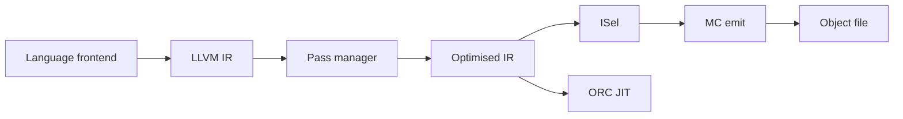

import { ConceptTemplate } from '@/features/kb/components/templates/ConceptTemplate'
import { Callout } from '@/features/kb/components/mdx/Callout'
import { ComparisonTable } from '@/features/kb/components/mdx/ComparisonTable'

export default function Layout({ children }) {
  return (
    <ConceptTemplate title="LLVM">
      {children}
    </ConceptTemplate>
  )
}

**LLVM** is a toolkit, not a single compiler. Frontends emit **LLVM IR**. The optimiser rewrites that IR. Backends produce machine code for x86, ARM, RISC-V, GPUs, and more. Clang, rustc, Swift, Zig, Julia, and many GPU stacks sit on this shared middle and back end.

## 1. Deep Dive and Mechanics

**LLVM IR** is a typed SSA language you can write as text (.ll) or bitcode (.bc). Instructions include add, load, store, phi, call, and getelementptr. The type system used to have a generic pointer; newer IR is **opaque pointers** plus explicit types on the instruction.

**Pass managers.** The new pass manager runs module, function, and loop passes with analyses (dominators, AA) cached and invalidated. Inlining, InstCombine, GVN, LICM, and vectorization are the usual suspects.

**Codegen.** IR is lowered through SelectionDAG or GlobalISel to MachineIR, then register-allocated and emitted. ORC JIT APIs reuse the same backends in-process.

<Callout icon="info" title="LLVM is not only clang">
rustc, Swift, Julia, and MLIR-based compilers all produce LLVM IR (or lower to it). Clang is one frontend. Saying "compiled with LLVM" without naming the frontend is incomplete.
</Callout>

## 2. Mathematical / Theoretical Foundation

LLVM IR is an SSA CFG plus a memory model. Optimisations are rewrite rules that must preserve the LangRef semantics of **undefined behavior**, **poison**, and **undef**. That is why "the optimiser is buggy" is often "the frontend promised nsw on an add that C++ said could wrap."

Alias analysis answers whether two pointers may refer to the same object. It is conservative: "don't know" means "do not reorder." TBAA and scoped noalias add language facts.

<ComparisonTable
  headers={['Layer', 'Artifact', 'Who writes it', 'Who consumes it']}
  rows={[
    ['Frontend', 'LLVM IR', 'clang, rustc, swiftc', 'opt'],
    ['Middle end', 'Optimised IR', 'opt passes', 'llc / codegen'],
    ['Backend', 'Object / asm', 'llc, MC', 'linker'],
    ['MLIR', 'Dialect IR', 'ML / HPC compilers', 'LLVM or runtime'],
  ]}
/>

## 3. Real-World Implementation

```bash
clang -S -emit-llvm -O0 add.c -o add.ll
opt -O2 add.ll -S -o add.opt.ll
llc -O2 add.opt.ll -o add.s

# In-process JIT (ORC) is the API behind lli and many embedders
lli add.opt.ll
```

Read add.ll. The names, the phi nodes after you add a loop, and the attributes on the function tell you what the optimiser is allowed to do.

## 4. Visualizations



## 5. Interview Prep

**Q: LLVM IR versus GCC GIMPLE?**
**A:** Same job: SSA mid-level IR. Different type systems, plugin APIs, and ecosystems. You cannot feed GIMPLE to llc.

**Q: What is bitcode stability?**
**A:** LLVM bitcode is **not** a long-term portable ABI. Apple ships a planned subset. Everyone else should treat .bc as a cache for the same LLVM version.

**Q: Why MLIR then?**
**A:** LLVM IR is a poor place to represent tensor layouts or GPU shared-memory tiles. MLIR keeps domain dialects and lowers toward LLVM IR at the edge.

## 6. Production Use Cases

- **OS and app toolchains** (Apple, Android NDK, Rust release builds).
- **JIT embedders** (Julia, some database engines, game tools) via ORC.
- **GPU and ML compilers** that exit through LLVM or a sibling backend.

<Callout icon="warning" title="Link the same LLVM version">
LTO bitcode from LLVM 17 will not reliably open in LLVM 19. Pin the compiler across the monorepo and CI images.
</Callout>
