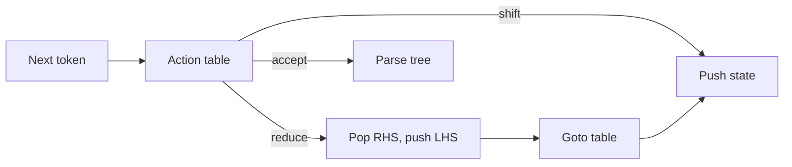

import { ConceptTemplate } from '@/features/kb/components/templates/ConceptTemplate'
import { Callout } from '@/features/kb/components/mdx/Callout'
import { ComparisonTable } from '@/features/kb/components/mdx/ComparisonTable'

export default function Layout({ children }) {
  return (
    <ConceptTemplate title="LR Parsing (Bottom-Up)">
      {children}
    </ConceptTemplate>
  )
}

**LR parsing** reads Left-to-right and builds a Reverse rightmost derivation. It is bottom-up: shift tokens onto a stack, and when the top matches a production's right-hand side, reduce to the left-hand side. LR(1) and its compressed cousins LALR(1) and SLR(1) power yacc, bison, happy, and lalrpop.

## 1. Deep Dive and Mechanics

The parser is a table-driven automaton. Each state is a set of **items** (a production with a dot marking how much of the right-hand side is seen). The next token plus the state choose **shift**, **reduce**, **accept**, or **error**.

**Conflicts.** Shift/reduce: the classic dangling-else. Reduce/reduce: the grammar is ambiguous or the table construction lost distinctions (LALR can merge states that LR(1) would keep). Precedence declarations (%left, %right) resolve the common expression conflicts without rewriting the grammar.

**GLR.** When the grammar is truly ambiguous (C++, some natural-language fragments), a GLR parser forks the stack and continues. That is slower but can accept the union of LR languages plus ambiguity.

<Callout icon="tip" title="Left recursion is a feature">
E -> E + T | T is natural LR and gives left-associative trees. The same grammar is poison for naive LL. Prefer LR or a Pratt parser for expression-heavy languages.
</Callout>

## 2. Mathematical / Theoretical Foundation

An LR(1) item is a triple (production, dot position, lookahead). The closure and goto operations build a DFA whose language is viable prefixes of right sentential forms. The parse table is that DFA plus reduce actions keyed by lookahead.

LR(1) is the most powerful deterministic context-free class in common use. LALR(1) merges states with the same core items, shrinking tables, and may introduce reduce/reduce conflicts that full LR(1) would not have.

<ComparisonTable
  headers={['Table', 'Power', 'Table size', 'Used by']}
  rows={[
    ['SLR(1)', 'Weakest common', 'Small', 'Teaching'],
    ['LALR(1)', 'Most yacc grammars', 'Small', 'bison, many generators'],
    ['LR(1)', 'Strongest classic', 'Large', 'IELR, some modern gens'],
    ['GLR', 'Ambiguous CFGs', 'Forks stacks', 'Elkhound, some C++'],
  ]}
/>

## 3. Real-World Implementation

```text
# Conceptual bison-like grammar (not a full project)
expr
    : expr '+' term   { /* reduce: left-assoc add */ }
    | term
    ;
term
    : NUMBER
    | '(' expr ')'
    ;
```

Shift NUMBER, reduce to term, reduce to expr, shift +, shift NUMBER, reduce, reduce. The stack holds states, not only symbols.

## 4. Visualizations



## 5. Interview Prep

**Q: Shift/reduce versus reduce/reduce?**
**A:** Shift/reduce is often resolved with precedence (dangling else: prefer shift). Reduce/reduce usually means the grammar is ambiguous or LALR merged too much; fix the grammar.

**Q: Why do textbooks still teach LR if everyone writes recursive descent?**
**A:** RD is nicer for diagnostics. LR is nicer for expressions and for generated parsers. Senior compiler interviews expect both, plus when to pick each.

**Q: Is JSON LR(1)?**
**A:** Yes, easily. So is a typical arithmetic grammar. C++ is not a clean LALR(1) story.

## 6. Production Use Cases

- **Language tools** generated from bison/lalrpop grammars (Ruby MRI parse.y historically, many query engines).
- **Protocol and config parsers** where a grammar file is the spec.
- **IDE incremental parsers** sometimes use GLR or error-tolerant LR variants.

<Callout icon="warning" title="Generated parsers still need a hand-written lexer">
yacc does not solve string escapes, layout rules, or the C++ lexer hack. Budget time for the tokenizer.
</Callout>
