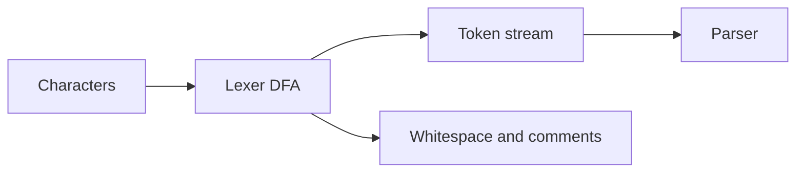

import { ConceptTemplate } from '@/features/kb/components/templates/ConceptTemplate'
import { Callout } from '@/features/kb/components/mdx/Callout'
import { ComparisonTable } from '@/features/kb/components/mdx/ComparisonTable'

export default function Layout({ children }) {
  return (
    <ConceptTemplate title="Lexical Analysis (Lexing)">
      {children}
    </ConceptTemplate>
  )
}

A **lexer** (scanner) turns a character stream into a token stream. `let x = 10;` becomes something like KEYWORD(let), IDENT(x), EQ, NUMBER(10), SEMI. Spaces and comments disappear unless a formatter asked to keep them as trivia.

## 1. Deep Dive and Mechanics

The lexer keeps a cursor and a state. It peeks at the next character, follows a transition, and when it hits an accepting state it emits a token and restarts. Longest-match (maximal munch) is the usual rule: `==` is one EQEQ, not two EQ. Keywords are identifiers that hit a reserved-word table.

**Hand-written versus generated.** Clang and rustc write the lexer by hand for speed and diagnostics. lex/flex and re2c generate tables from regular definitions.

**Ugly cases.** Nested comments (not regular if truly nested). Python indent/dedent (a stack, not a DFA). C++'s lexer hack (the token kind of an identifier depends on the symbol table). Raw strings and heredocs with custom delimiters.

<Callout icon="tip" title="Keep source locations on every token">
Line, column, and byte offset are not optional. Every later diagnostic, source map, and IDE highlight is a span on a token or AST node.
</Callout>

## 2. Mathematical / Theoretical Foundation

Token patterns are **regular languages**. A regular expression compiles to an NFA (Thompson), then a DFA (subset construction), then a minimised DFA (Hopcroft). Lexing is O(n) in the input length for a fixed DFA.

Nested comments of unbounded depth are **not** regular; they need a counter (a CFG or a small PDA). That is why `/* ... */` in C is specified as non-nested, keeping the lexer regular.

<ComparisonTable
  headers={['Input slice', 'Lexer decision', 'Token', 'Note']}
  rows={[
    ['let', 'Ident then keyword table', 'KEYWORD', 'Reserved word'],
    ['x', 'Ident', 'IDENT', 'Payload is the spelling'],
    ['10', 'Digit run', 'NUMBER', 'Parse later or here'],
    ['// to newline', 'Skip', 'none', 'Or keep as trivia'],
  ]}
/>

## 3. Real-World Implementation

```python
import re

TOKEN = re.compile(
    r's+|//.*?$|(?P<num>d+)|(?P<id>[A-Za-z_]w*)|(?P<eq>==)|(?P<op>[=+;])',
    re.M,
)
KEYWORDS = {'let', 'if', 'else'}

def lex(src):
    tokens = []
    for m in TOKEN.finditer(src):
        if m.group('num'):
            tokens.append(('NUMBER', int(m.group('num'))))
        elif m.group('id'):
            name = m.group('id')
            kind = 'KEYWORD' if name in KEYWORDS else 'IDENT'
            tokens.append((kind, name))
        elif m.group('eq'):
            tokens.append(('EQEQ', '=='))
        elif m.group('op'):
            tokens.append((m.group('op'), m.group('op')))
    return tokens

print(lex('let x = 10;'))
```

Production lexers avoid backtracking regex and use an explicit state machine so errors can say "invalid character U+0007 at 12:3."

## 4. Visualizations



## 5. Interview Prep

**Q: Why not let the parser read characters?**
**A:** You would mix regular work with context-free work and make error messages worse. The split is the first example of "use the weakest machine that works."

**Q: Longest match versus priority?**
**A:** Longest match first (foo12 is one ident). If two patterns match the same span, the rule listed first in the spec wins (keyword versus ident is often handled after the ident match).

**Q: Is lexing decidable in linear time?**
**A:** For a fixed regular token set, yes. If token class depends on arbitrary parse state (lexer hack), you have coupled the phases.

## 6. Production Use Cases

- **Every compiler and interpreter** starts here.
- **Syntax highlighters** often use a cheaper lexer-only grammar (TextMate, tree-sitter has a real parser).
- **Secret scanners and linters** tokenize before they look at structure.

<Callout icon="warning" title="Unicode is part of the spec">
Identifier sets, BOM, and CRLF versus LF must be defined. A lexer that assumes ASCII will mis-split real-world source.
</Callout>
