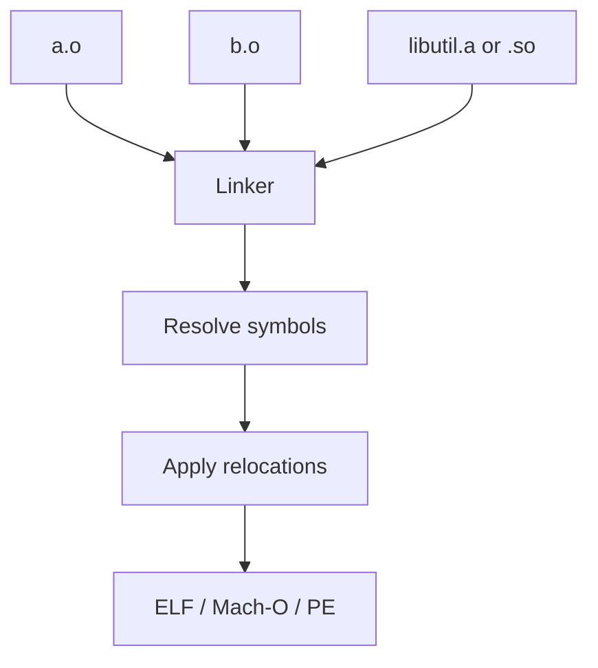

import { ConceptTemplate } from '@/features/kb/components/templates/ConceptTemplate'
import { Callout } from '@/features/kb/components/mdx/Callout'
import { ComparisonTable } from '@/features/kb/components/mdx/ComparisonTable'

export default function Layout({ children }) {
  return (
    <ConceptTemplate title="Linking">
      {children}
    </ConceptTemplate>
  )
}

**Linking** takes relocatable object files and produces an executable, a shared library, or another object. Each .o still has holes: call foo is a relocation toward a symbol the compiler did not define in that file. The linker assigns final addresses, patches those holes, and pulls in archive members that satisfy undefined symbols.

## 1. Deep Dive and Mechanics

**Symbols.** Defined or undefined, local or global, strong or weak. Two strong definitions of the same global is a multiple-definition error. Weak symbols and COMDAT groups (C++ inline, templates) let duplicates collapse.

**Relocations.** Architecture-specific records: "add the final address of bar plus addend into this 32-bit field." PIC uses relative relocations so a DSO can load anywhere.

**Static versus dynamic.** Static linking copies library code into the binary. Dynamic linking records NEEDED libraries and leaves relocations for the loader (ld.so) to finish. Windows (PE), macOS (Mach-O), and Linux (ELF) differ in details but not in the idea.

**LTO.** If objects contain IR, the linker may invoke the compiler again before the final address assignment.

<Callout icon="warning" title="Link order still surprises people">
Traditional Unix archives are scanned once, left to right. If libA needs a symbol from libB, write -lA -lB, not the reverse. --start-group or --whole-archive is the escape hatch, not the default.
</Callout>

## 2. Mathematical / Theoretical Foundation

Think of each object as a graph node whose outgoing edges are undefined symbols and incoming edges are defined symbols. Linking is a closure: start from the entry (or from all .o on the command line) and include archive members that resolve an edge, until a fixpoint.

Address assignment is a layout problem under alignment constraints. Relocation is evaluation of a small linear expression (symbol + addend - origin) written into a field of limited width; overflow is a link error (jump too far, need a stub).

<ComparisonTable
  headers={['Mode', 'When addresses bind', 'Binary size', 'Patch story']}
  rows={[
    ['Static', 'Link time', 'Larger', 'Rebuild to update a lib'],
    ['Dynamic', 'Load / first call', 'Smaller text', 'Replace the .so/.dll'],
    ['LTO static', 'Link-time compile', 'Can shrink', 'Same as static'],
    ['Relocatable ld -r', 'Partial', 'Still an .o', 'Later final link'],
  ]}
/>

## 3. Real-World Implementation

```bash
cc -c a.c b.c
cc -o app a.o b.o -L. -lutil
ldd ./app
readelf -s a.o | head
nm a.o

# Shared library
cc -fPIC -shared -o libutil.so util.c
cc -o app a.o -L. -lutil -Wl,-rpath,$ORIGIN
```

Use `nm`, `readelf`, `dumpbin`, or `otool` before you guess why a symbol is missing.

## 4. Visualizations



## 5. Interview Prep

**Q: Linker versus loader?**
**A:** The linker runs at build time (or at LTO time). The dynamic loader runs when the process starts and performs remaining relocations, symbol interposition, and library search.

**Q: What is a relocation?**
**A:** A note in the object file that a field cannot be filled until a symbol has an address. The linker or loader writes the address.

**Q: Why -fPIC for shared libraries?**
**A:** The library may load at a different base. Position-independent code uses relative addressing and a GOT/PLT so text pages stay shareable and reloc-light.

## 6. Production Use Cases

- **Every native build** (C/C++/Rust/Go) ends in a link, even if rustc hides ld.
- **Plugin systems** that dlopen a DSO with a known exported symbol.
- **Hermetic builds** that pin linker (bfd, gold, lld, mold) and flags for reproducibility.

<Callout icon="info" title="lld and mold are drop-in speedups">
For large C++ links, switching from bfd ld to lld or mold can cut minutes to seconds. Keep a compatibility job if you rely on GNU-only linker scripts.
</Callout>
