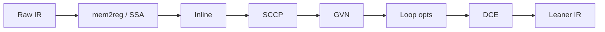

import { ConceptTemplate } from '@/features/kb/components/templates/ConceptTemplate'
import { Callout } from '@/features/kb/components/mdx/Callout'
import { ComparisonTable } from '@/features/kb/components/mdx/ComparisonTable'

export default function Layout({ children }) {
  return (
    <ConceptTemplate title="Optimization Passes">
      {children}
    </ConceptTemplate>
  )
}

An **optimisation pass** reads IR and writes better IR. "Better" usually means fewer instructions, fewer loads, more vector-friendly loops, or better inlining decisions — without changing what a well-defined program does. Compilers run dozens of passes in a pipeline because each pass creates opportunities for the next.

## 1. Deep Dive and Mechanics

**Local.** Constant folding, algebraic identities, peepholes. **Global.** Dead code elimination, sparse conditional constant propagation, GVN/PRE. **Loop.** LICM, unrolling, vectorization, strength reduction. **Interprocedural.** Inlining, IPO constant prop, devirtualization.

**Order matters.** DCE after inlining deletes now-dead formals. InstCombine after GVN shrinks what GVN made redundant. Pass managers rerun some passes to a fixpoint under a budget.

**Correctness.** A pass must respect the IR spec: memory aliasing, unwind edges, volatile, atomics, and language UB. Fast-math flags and restrict/noalias are extra axioms the frontend opted into.

<Callout icon="warning" title="Undefined behavior is optimiser fuel">
If C says signed overflow is UB, the pass may assume it never happens and delete an overflow check you thought you wrote. Sanitizers exist because those assumptions are sharp.
</Callout>

## 2. Mathematical / Theoretical Foundation

Many scalar passes are monotone dataflow or e-graph style rewriting. DCE is liveness: a value is dead if it is never used on any path that has a side effect. GVN hashes expressions; congruent values can share a name.

Inlining is a search problem: each call site is a candidate; the cost model estimates code-size and a heuristic benefit. NP-hard in general; compilers use greedy budgets.

Phase ordering is also hard: no linear order of passes is optimal for all programs. That is why pipelines are tuned on huge benchmark sets, not proved optimal.

<ComparisonTable
  headers={['Pass', 'What it does', 'Depends on', 'Risk if wrong']}
  rows={[
    ['InstCombine / fold', 'Local rewrite', 'Wrap flags', 'Wrong value'],
    ['DCE', 'Drop unused', 'Side-effect model', 'Drop a store'],
    ['LICM', 'Hoist from loops', 'Alias + throw', 'Hoist a trap'],
    ['Inline', 'Copy callee in', 'Cost model', 'Size blowup'],
  ]}
/>

## 3. Real-World Implementation

```llvm
; Before SCCP + DCE
define i32 @f() {
  %a = add i32 2, 3
  %b = mul i32 %a, 1
  ret i32 %b
}

; After:  ret i32 5
```

On the command line: `opt -passes=mem2reg,instcombine,dce`. mem2reg first, because SSA names unlock everything else.

## 4. Visualizations



## 5. Interview Prep

**Q: Name three must-have passes and why.**
**A:** mem2reg (SSA), inlining (exposes context), and DCE (cleans up). Almost every other win depends on those.

**Q: Why can -O3 be slower than -O2?**
**A:** Over-unrolling and over-inlining blow the I-cache. Vectorization can also pessimize tiny trip counts. Measure.

**Q: What is a pass manager?**
**A:** The scheduler for analyses and transforms. It knows that instcombine invalidates some analyses and that dominators can be reused until a CFG edit.

## 6. Production Use Cases

- **Release builds** of C++, Rust, and Swift are "the pass pipeline on a time budget."
- **LTO** runs interprocedural passes on the merged IR of many crates or TUs.
- **GPU compilers** add passes for occupancy, shared-memory promotion, and predication.

<Callout icon="tip" title="Debug opts with before/after IR">
When a pass "breaks" a program, dump IR before and after that pass. Either the frontend lied about flags, or you found a real compiler bug — both happen.
</Callout>
