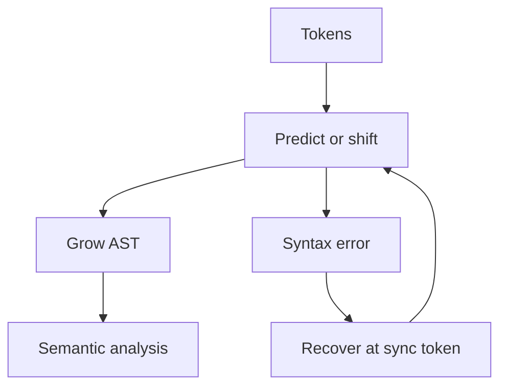

import { ConceptTemplate } from '@/features/kb/components/templates/ConceptTemplate'
import { Callout } from '@/features/kb/components/mdx/Callout'
import { ComparisonTable } from '@/features/kb/components/mdx/ComparisonTable'

export default function Layout({ children }) {
  return (
    <ConceptTemplate title="Parsing (Syntax Analysis)">
      {children}
    </ConceptTemplate>
  )
}

**Parsing** decides whether a token stream belongs to the language and, if so, how it is structured. The output is a parse tree or AST. The input is the lexer. The contract is a grammar: context-free for most programming languages, with extra side conditions (indentation, type-driven disambiguation) that leak out of pure CFGs.

## 1. Deep Dive and Mechanics

A parser is either **top-down** (expand the start symbol, recursive descent, LL) or **bottom-up** (shift-reduce, LR). Both can be hand-written or generated. Production C++ and Rust parsers are hand-written for error quality; many query languages and DSLs are generated.

**Error recovery.** Panic-mode skips to a synchronising token. Phrase-level repair invents or deletes a token. IDEs need an incremental, error-tolerant parse so a missing paren does not blank the whole file's highlighting.

**Ambiguity.** If two trees exist, the language spec must pick (dangling else, C++ most-vexing parse). The parser implements that policy with precedence, extra lookahead, or a semantic predicate.

<Callout icon="info" title="Syntax is not meaning">
A parse can succeed and the program can still be illegal: undeclared names, type errors, break outside a loop. That is semantic analysis, the next phase.
</Callout>

## 2. Mathematical / Theoretical Foundation

The language of balanced parentheses is context-free, not regular. Most programming-language syntax is designed to be deterministic context-free (LL or LR) so parsing is linear. Full CFG recognition can be cubic (CYK, Earley) and is used for ambiguous or natural-language-like inputs.

A derivation is a sequence of production rewrites. The parse tree is that derivation drawn as a tree. Ambiguity means two distinct leftmost (or rightmost) derivations for one string.

<ComparisonTable
  headers={['Algorithm', 'Class', 'Time', 'Use']}
  rows={[
    ['Recursive descent / LL', 'LL(k)', 'Linear', 'Hand-written frontends'],
    ['LALR / LR', 'Deterministic CFG', 'Linear', 'yacc family'],
    ['Earley / GLR', 'All CFGs', 'Cubic worst', 'Ambiguous grammars'],
    ['Packrat PEG', 'PEG, not CFG', 'Linear with memo', 'Parser combinators'],
  ]}
/>

## 3. Real-World Implementation

```python
# Pratt / precedence-climbing sketch for + and *
PRECEDENCE = {'+': 10, '*': 20}

def parse_expr(tokens, min_prec=0):
    token, *rest = tokens
    left, tokens = token, rest  # assume numbers already
    while tokens and tokens[0] in PRECEDENCE and PRECEDENCE[tokens[0]] >= min_prec:
        op = tokens[0]
        prec = PRECEDENCE[op]
        rhs, tokens = parse_expr(tokens[1:], prec + 1)
        left = (op, left, rhs)
    return left, tokens
```

Pratt parsers are the usual way hand-written frontends handle expressions without a huge cascade of parse_additive / parse_multiplicative functions.

## 4. Visualizations



## 5. Interview Prep

**Q: Lexer versus parser?**
**A:** Lexer: regular patterns, tokens. Parser: nested structure, grammar. Do not use regex to "parse" HTML or C++.

**Q: Why is parsing not enough to compile?**
**A:** Names, types, definite assignment, and borrow rules are not in the CFG. You need symbol tables and a type checker.

**Q: What makes a good syntax error?**
**A:** A single primary span, a likely fix, and continued parse so the user sees the next real mistake, not a cascade.

## 6. Production Use Cases

- **Compilers and interpreters** for every general-purpose language.
- **tree-sitter** grammars inside editors for incremental highlighting.
- **SQL engines** parse then bind and plan; the parse tree is the first IR.

<Callout icon="tip" title="Write tests as source files, not only unit trees">
Keep a corpus of programs that must parse and a corpus that must fail with a stable message. Parser refactors break both silently.
</Callout>
