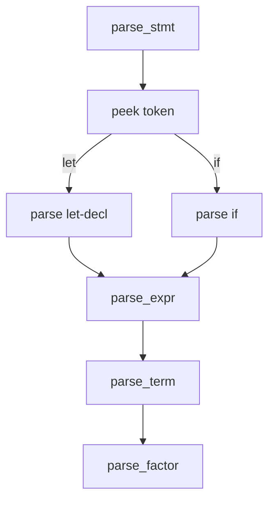

import { ConceptTemplate } from '@/features/kb/components/templates/ConceptTemplate'
import { Callout } from '@/features/kb/components/mdx/Callout'
import { ComparisonTable } from '@/features/kb/components/mdx/ComparisonTable'

export default function Layout({ children }) {
  return (
    <ConceptTemplate title="Recursive Descent Parsing">
      {children}
    </ConceptTemplate>
  )
}

**Recursive descent** implements a grammar as mutually recursive functions. parse_stmt looks at the next token, then calls parse_expr or parse_block. The call stack **is** the parser stack. Clang, rustc, tsc, and Go's parser are all recursive descent with extra lookahead and recovery.

## 1. Deep Dive and Mechanics

Each function consumes tokens through a shared cursor. It fails by returning an error or by recording a diagnostic and skipping to a sync point. Optional constructs are if-peek-then-parse. Repeated constructs are while-peek.

**Expressions.** A naive function-per-precedence-level works (parse_or, parse_and, parse_eq, ...) and maps to a precedence table. Pratt parsing is the compact form of the same idea.

**Why hand-write.** You control messages, you can mix in semantic predicates (is this ident a type?), and you can parse incrementally. Generated LL/LR is faster to start and harder to make feel native in an IDE.

<Callout icon="warning" title="Watch the call stack on left recursion">
A function that immediately calls itself with the same cursor will recurse until the process dies. Rewrite left recursion or use an explicit loop for left-associative operators.
</Callout>

## 2. Mathematical / Theoretical Foundation

Recursive descent with one token of lookahead implements LL(1) if each function's branches have disjoint FIRST sets. With arbitrary peeking and backtracking it can accept more, at the cost of exponential time unless you memoize (packrat).

The correspondence is mechanical: a production A -> B C becomes a call to parse_B then parse_C. A production A -> a becomes "expect token a." Alternatives become a switch on peek.

<ComparisonTable
  headers={['Style', 'Lookahead', 'Left recursion', 'Diagnostics', 'Where']}
  rows={[
    ['Pure LL(1) RD', '1', 'Forbidden', 'Good if you invest', 'Teaching, DSLs'],
    ['RD + Pratt', '1 + binding power', 'Loops for ops', 'Excellent', 'Most languages'],
    ['RD + backtrack', 'Unbounded', 'Dangerous', 'Can be muddy', 'C++ tentative parse'],
    ['Generated LALR', '1', 'OK', 'Often generic', 'bison grammars'],
  ]}
/>

## 3. Real-World Implementation

```python
class Parser:
    def __init__(self, tokens):
        self.tokens = tokens
        self.i = 0

    def peek(self):
        return self.tokens[self.i] if self.i < len(self.tokens) else None

    def eat(self, kind):
        tok = self.peek()
        if tok != kind:
            raise SyntaxError(f'expected {kind} got {tok}')
        self.i += 1

    def parse_stmt(self):
        if self.peek() == 'let':
            self.eat('let')
            self.eat('ident')
            self.eat('=')
            self.parse_expr()
            self.eat(';')
            return
        raise SyntaxError('expected statement')

    def parse_expr(self):
        self.eat('number')
```

Add a real token type (kind, spelling, span) before this leaves a toy.

## 4. Visualizations



## 5. Interview Prep

**Q: Recursive descent versus table-driven LL?**
**A:** Same family. RD is code you can step through in a debugger. Tables are smaller to generate from a grammar file and easier to prove LL(1).

**Q: How do you parse binary operators without left recursion?**
**A:** Loop: parse a tighter operand, while the next operator has high enough precedence, consume it and parse the right-hand side. That is Pratt / precedence climbing.

**Q: How do production parsers recover?**
**A:** Emit an error, skip tokens until a token in the FOLLOW set of the current construct (semicolon, end of block), then continue so one typo does not hide the rest.

## 6. Production Use Cases

- **Industrial language frontends** that care about diagnostics (Clang, rustc, javac).
- **Config loaders** (TOML, custom DSL) where a 200-line RD parser beats a generator.
- **REPLs** that parse incomplete input and ask for the next line.

<Callout icon="tip" title="Thread spans through every return">
If parse_expr returns only a value and not a span, you will rewrite the parser when you add errors. Return a node with a source range from day one.
</Callout>
