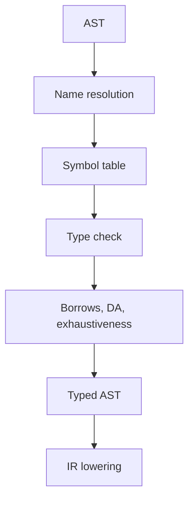

import { ConceptTemplate } from '@/features/kb/components/templates/ConceptTemplate'
import { Callout } from '@/features/kb/components/mdx/Callout'
import { ComparisonTable } from '@/features/kb/components/mdx/ComparisonTable'

export default function Layout({ children }) {
  return (
    <ConceptTemplate title="Semantic Analysis">
      {children}
    </ConceptTemplate>
  )
}

**Semantic analysis** is everything the grammar cannot say. The parser accepted the tokens. Now the compiler asks: does this name exist? Does this call match a function? Is this return type right? Is this break inside a loop? Only after those checks is the AST safe to lower to IR.

## 1. Deep Dive and Mechanics

**Symbol tables / scopes.** A stack of maps from names to declarations. Entering a block pushes a scope; leaving pops. Imports and modules add more namespaces. Shadowing rules are language policy.

**Type checking.** Bidirectional systems synthesise a type from an expression or check an expression against an expected type. Overload resolution and generics instantiate schemes. Rust's borrow checker and TypeScript's control-flow narrowing are extra semantic passes on top of types.

**Definite assignment, exhaustiveness, purity.** Languages pile on analyses that are still "static semantics" even if they are not Hindley-Milner.

<Callout icon="info" title="Syntax OK, program illegal">
int x = "hi"; parses in many C-like grammars if the grammar does not embed types. The type checker is the phase that rejects it. Interviews love this split.
</Callout>

## 2. Mathematical / Theoretical Foundation

Name binding is a map from use sites to declaration sites, usually modeled with environments (gamma). A typing judgment gamma |- e : T means expression e has type T under that environment.

Hindley-Milner inference is unification plus let-generalisation. Bidirectional typing (check versus infer) scales better to subtyping and implicits. Soundness: if the checker says T, evaluation should not get stuck (progress and preservation).

<ComparisonTable
  headers={['Check', 'Question', 'Failure mode', 'Example']}
  rows={[
    ['Resolve', 'Which decl is this name?', 'undeclared / ambiguous', 'Unknown ident'],
    ['Type', 'Do the types fit?', 'mismatch', 'string + array'],
    ['Flow', 'Is this reachable / assigned?', 'use before init', 'Java DA'],
    ['Effect / borrow', 'Is this use allowed?', 'alias / race / move', 'Rust, Swift'],
  ]}
/>

## 3. Real-World Implementation

```python
def check(node, env):
    kind = node[0]
    if kind == 'num':
        return 'int'
    if kind == 'var':
        if node[1] not in env:
            raise TypeError(f'undeclared {node[1]}')
        return env[node[1]]
    if kind == 'add':
        lt = check(node[1], env)
        rt = check(node[2], env)
        if lt != 'int' or rt != 'int':
            raise TypeError('add expects int')
        return 'int'
    if kind == 'let':
        name, value, body = node[1], node[2], node[3]
        child = dict(env)
        child[name] = check(value, env)
        return check(body, child)
    raise TypeError(kind)
```

Real checkers attach the computed type to the AST node so later IR lowering does not re-infer.

## 4. Visualizations



## 5. Interview Prep

**Q: Why not encode types in the grammar?**
**A:** Types depend on declarations that may appear later, on imports, and on inference. A CFG cannot look up a user-defined class name without a symbol table.

**Q: What is a type environment?**
**A:** The map of in-scope names to types (and sometimes mutability, linearity, or nullness). Checking a lambda extends the environment with the parameter.

**Q: Semantic versus syntactic errors — give one each.**
**A:** Missing paren: syntax. Calling a string: semantic. Both should have spans.

## 6. Production Use Cases

- **Every statically typed compiler** (javac, rustc, Swift, Go, C++ Sema).
- **IDEs** run the same resolution and types for hover and completion.
- **Bytecode verifiers** redo a slice of semantic checks on untrusted IR.

<Callout icon="tip" title="Keep resolution deterministic">
If two imports can bind the same name, error. Implicit fallback to "any" or to a global is how codebases become unsearchable.
</Callout>
