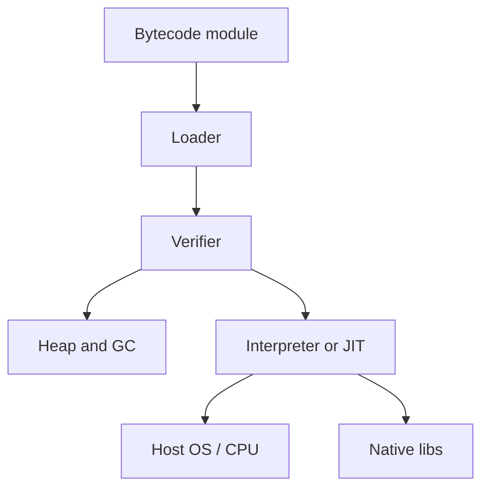

import { ConceptTemplate } from '@/features/kb/components/templates/ConceptTemplate'
import { Callout } from '@/features/kb/components/mdx/Callout'
import { ComparisonTable } from '@/features/kb/components/mdx/ComparisonTable'

export default function Layout({ children }) {
  return (
    <ConceptTemplate title="Virtual Machines (Language Level)">
      {children}
    </ConceptTemplate>
  )
}

A **language virtual machine** is a process that implements a stable execution model for a language or a family of languages. It loads bytecode (or WASM), verifies it, interprets or JITs it, and provides GC, threads, and a standard library. It is not a hypervisor and not a whole guest OS.

## 1. Deep Dive and Mechanics

**Load and verify.** Classloaders (JVM) or assemblies (CLR) resolve symbolic references. A verifier checks stack maps and types so the interpreter can trust the code.

**Execute.** Interpreter loop, JIT tiers, and sometimes AOT caches (CDS, ReadyToRun, WASM compiled once).

**Services.** Garbage collection, exception unwinding, reflection, JIT deopt, and a foreign-function interface. The VM is an operating system for managed code.

**Isolation.** WASM instances and JVM security managers (legacy) try to sandbox untrusted modules. Today the practical sandbox is often a process plus WASM, not a bytecode verifier alone.

<Callout icon="info" title="VM versus interpreter versus runtime">
People say "the Python VM" for CPython's bytecode loop, "the JVM" for a full managed platform, and "the JS runtime" for V8 plus libuv. The shared idea is: portable program + host that defines memory and calls.
</Callout>

## 2. Mathematical / Theoretical Foundation

A VM is an abstract machine: a state (heap, stacks, pc) and a step relation given by the opcode spec (JVM spec, ECMA-335, WASM Core). Verification is a type system for that machine.

GC is a graph reachability problem on the heap. JIT compilation is a semantics-preserving translation from the abstract machine to a concrete ISA, with deopt as the escape hatch.

<ComparisonTable
  headers={['VM', 'Deploy artifact', 'Memory', 'Notable']}
  rows={[
    ['JVM', 'class / JAR', 'GC', 'Huge language family'],
    ['CLR', 'IL assemblies', 'GC', 'C# and friends'],
    ['CPython', 'pyc / source', 'RC + GC', 'C API ecosystem'],
    ['WASM engine', 'wasm module', 'Linear memory', 'Sandbox + polyglot'],
  ]}
/>

## 3. Real-World Implementation

```python
class Frame:
    def __init__(self, locals_n):
        self.locals = [None] * locals_n
        self.stack = []

class TinyVM:
    def run(self, code, consts):
        fr = Frame(8)
        pc = 0
        while pc < len(code):
            op, *args = code[pc]
            pc += 1
            if op == 'const':
                fr.stack.append(consts[args[0]])
            elif op == 'add':
                fr.stack.append(fr.stack.pop() + fr.stack.pop())
            elif op == 'ret':
                return fr.stack.pop()
        raise RuntimeError('fell off end')
```

A real VM adds a heap, a call stack of frames, and a trap story for every illegal operation.

## 4. Visualizations



## 5. Interview Prep

**Q: Language VM versus OS VM (hypervisor)?**
**A:** A language VM virtualises an ISA invented for the language. A hypervisor virtualises a real machine ISA and runs a guest kernel. Different threat models, different artifacts.

**Q: Why do VMs still use bytecode instead of shipping LLVM IR?**
**A:** Bytecode is stable, verifiable, and small. LLVM IR is a compiler IR that changes and is not a security boundary.

**Q: What does "write once, run anywhere" actually require?**
**A:** A specified abstract machine, a specified library, and a loader that hides the OS. The moment you call native code, the promise shrinks.

## 6. Production Use Cases

- **Server-side Java/.NET** with multi-hour JIT warmup and GC tuning.
- **Android ART** (DEX, AOT profiles) as a mobile language VM.
- **WASM** in browsers and on the edge as a polyglot sandbox.

<Callout icon="warning" title="Tune GC with the allocation rate, not folklore">
Heap flags copied from a blog post will pause the wrong generation. Measure allocation rate and pause SLOs on your traffic.
</Callout>
