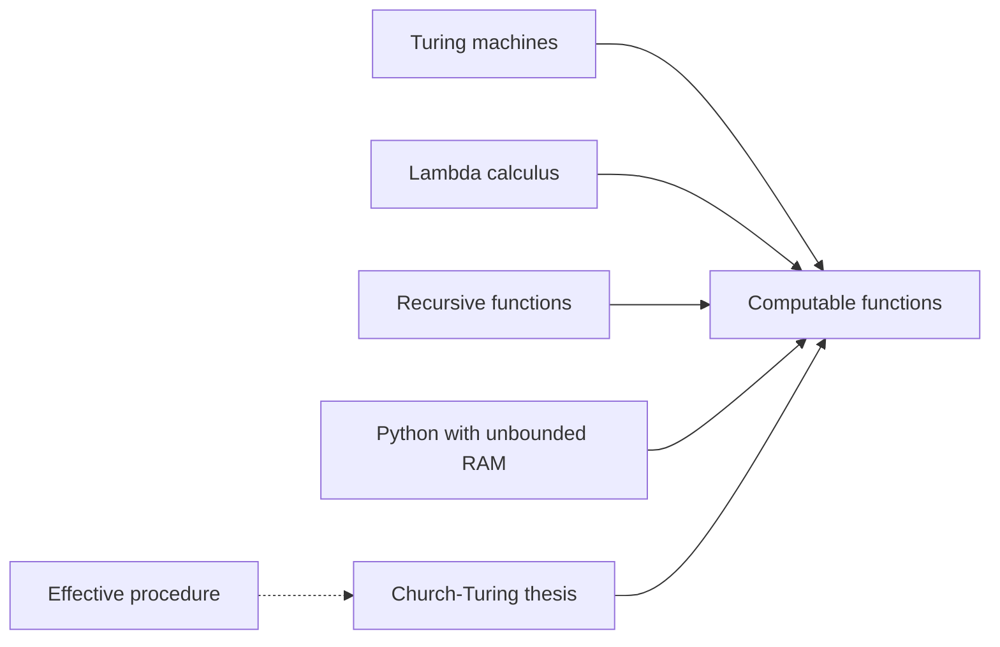

import { ConceptTemplate } from '@/features/kb/components/templates/ConceptTemplate'
import { Callout } from '@/features/kb/components/mdx/Callout'
import { ComparisonTable } from '@/features/kb/components/mdx/ComparisonTable'

export default function Layout({ children }) {
  return (
    <ConceptTemplate title="Church-Turing Thesis">
      {children}
    </ConceptTemplate>
  )
}

The **Church-Turing thesis** is not a theorem. It is the statement that the informal notion "what a human can calculate by a finite mechanical procedure" coincides with "what a Turing machine can compute." Alonzo Church proposed lambda-definability; Alan Turing proposed machines. They proved those two formalisms equivalent, then the field treated that class as the computable functions.

## 1. Deep Dive and Mechanics

Many models independently landed on the same class: Turing machines, untyped lambda calculus, general recursive functions, counter machines, RAM models, and any mainstream programming language with unbounded memory. A translation from one model to another is a compiler in the theoretical sense.

**What the thesis does not say.** It does not say physics cannot do more (quantum computers, in the standard circuit model, still compute the same functions, sometimes faster). It does not say every function on integers is computable — most are not. It does not give a complexity bound.

**Extended forms.** The physical Church-Turing thesis claims no physically realisable device beats TM computability. The efficient (or Cobham-Edmonds) thesis claims that "feasible" matches polynomial time across reasonable models, up to polynomial factors.

<Callout icon="info" title="Thesis, not theorem">
You cannot prove that a formal class equals an informal idea. You can only accumulate evidence: every serious model so far has been TM-equivalent, and proposed super-Turing machines smuggle infinite work or oracles.
</Callout>

## 2. Mathematical / Theoretical Foundation

Let C be the class of partial functions from naturals to naturals computed by some TM. Church's thesis: C equals the effectively calculable partial functions. Evidence includes equivalence proofs among TMs, lambda, and mu-recursive functions; stability of C when you change tape alphabet or tape count; and the failure of attempts to add obviously mechanical steps without also adding oracles.

If you add a halt-oracle you get a strictly larger class. That does not refute the thesis; it leaves the informal notion of "effective."

<ComparisonTable
  headers={['Model', 'Primitive', 'Same class as TM?', 'Notes']}
  rows={[
    ['Turing machine', 'Tape and finite control', 'By definition', 'Standard'],
    ['Lambda calculus', 'Application and abstraction', 'Yes', 'Church 1936'],
    ['mu-recursive functions', 'Zero, succ, compose, mu', 'Yes', 'Kleene'],
    ['Halting oracle TM', 'TM plus halt answers', 'No, strictly more', 'Not effective'],
  ]}
/>

## 3. Real-World Implementation

```python
# Evidence in miniature: two models computing the same function
def tm_style_inc(n):
    return n + 1  # a TM can increment a unary or binary numeral

def lambda_style_inc(n):
    return (lambda x: x + 1)(n)

assert tm_style_inc(41) == lambda_style_inc(41)
```

A real equivalence proof encodes TM transitions as lambda terms, or the reverse, and simulates step by step.

## 4. Visualizations



## 5. Interview Prep

**Q: Is the Church-Turing thesis proved?**
**A:** No. The equivalences among formal models are proved. The identification with informal calculability is a thesis.

**Q: Does quantum computing refute it?**
**A:** No. BQP sits inside the computable functions. Quantum changes resources, not the set of solvable problems, unless you change the model of physics.

**Q: Why should a working engineer care?**
**A:** Another language cannot compute the uncomputable. Porting an algorithm between models is always possible in theory, with a possibly huge overhead.

## 6. Production Use Cases

- **Language design:** a feature is Turing complete when it can simulate a TM, sometimes by accident (templates, CSS, spreadsheets).
- **Sandboxing:** if your config language is Turing complete, you cannot bound runtime by inspection alone.
- **Specs** that define algorithm as something a TM could run, excluding oracles and human judgment.

<Callout icon="tip" title="Ask which thesis they mean">
Interviewers sometimes say Church-Turing when they mean P is the same across models. That is the efficient thesis, and it is more fragile because a RAM step is not a TM step.
</Callout>
