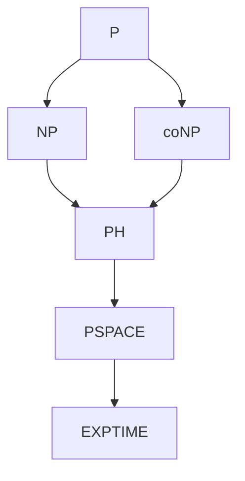

import { ConceptTemplate } from '@/features/kb/components/templates/ConceptTemplate'
import { Callout } from '@/features/kb/components/mdx/Callout'
import { ComparisonTable } from '@/features/kb/components/mdx/ComparisonTable'

export default function Layout({ children }) {
  return (
    <ConceptTemplate title="Computational Complexity Theory">
      {children}
    </ConceptTemplate>
  )
}

**Complexity theory** asks not "is it computable?" but "what does it cost?" Time, space, nondeterminism, randomness, and circuit size carve the decidable problems into classes. P versus NP is the celebrity question. The everyday tools are reductions, completeness, and the habit of naming the resource you are spending.

## 1. Deep Dive and Mechanics

A **complexity class** is a set of languages solvable by a model within a bound. **P**: deterministic TM, polynomial time. **NP**: verifiable in polynomial time, or solvable in polynomial time on a nondeterministic TM. **PSPACE**: polynomial space. **EXPTIME**: exponential time.

**Reductions.** A polynomial-time many-one reduction from A to B is a function f such that x is in A exactly when f(x) is in B. If A is NP-hard and A reduces to B, then B is NP-hard. SAT is the classic NP-complete problem (Cook-Levin).

**Beyond worst-case time.** Average-case complexity, smoothed analysis, parameterized complexity, and approximation ratios are how practitioners escape a blanket "NP-complete, give up."

<Callout icon="warning" title="NP-complete is not a synonym for impossible">
SAT solvers decide industrial instances every day. Complexity is a worst-case asymptotic statement. Use it to choose an approach — exact ILP, approximation, SAT encoding — not to stop thinking.
</Callout>

## 2. Mathematical / Theoretical Foundation

TIME(f) and SPACE(f) are defined with a precise TM model. Polynomial classes are robust: a RAM and a TM agree up to polynomial factors. Exponential classes are more model-sensitive.

The time hierarchy theorem: more time buys more languages for nice bounds. So P is not equal to EXPTIME. We still do not know whether P equals NP. Relativization, natural proofs, and algebrization explain why the usual techniques stall.

<ComparisonTable
  headers={['Class', 'Resource', 'Complete problem', 'Contains P?']}
  rows={[
    ['P', 'Det. poly time', 'Circuit value', 'Yes, equal'],
    ['NP', 'Poly-time verify', 'SAT, 3-SAT, CLIQUE', 'Yes'],
    ['coNP', 'Poly-time refute', 'TAUT', 'Yes'],
    ['PSPACE', 'Poly space', 'QBF', 'Yes'],
  ]}
/>

## 3. Real-World Implementation

```python
# Poly-time verifier for an NP certificate (subset sum)
def verify_subset_sum(nums, target, bits):
    if len(bits) != len(nums):
        return False
    total = sum(n for n, b in zip(nums, bits) if b)
    return total == target

# Finding bits is the hard search problem; checking is linear
print(verify_subset_sum([3, 5, 7], 10, [1, 0, 1]))
```

NP is about verification. The solver that finds bits can be exponential.

## 4. Visualizations



## 5. Interview Prep

**Q: P versus NP in one paragraph?**
**A:** P is problems we can solve quickly. NP is problems whose yes-answers we can check quickly. P equals NP would mean finding a solution is always about as easy as checking one. We do not know; most theorists expect they are not equal.

**Q: NP-hard versus NP-complete?**
**A:** Complete means in NP and NP-hard. Hard means at least as hard as every NP problem via a poly-time reduction. The halting problem is not NP-complete because it is not in NP.

**Q: Why do reductions matter in system design?**
**A:** If you reduce your scheduling problem to ILP or SAT, you inherit decades of solvers. If you reduce SAT to your API, you have advertised an NP-hard endpoint.

## 6. Production Use Cases

- **Compilers:** register allocation and instruction scheduling are NP-hard; compilers use heuristics.
- **Security:** crypto assumes certain problems stay out of P. Factoring is not known to be NP-complete.
- **Infra:** bin packing, vehicle routing, and query optimisation lean on approximations and timeouts.

<Callout icon="tip" title="State the model">
Saying O(n log n) needs a machine model — comparison RAM or word RAM. Complexity theory is pedantic about that for a reason.
</Callout>
