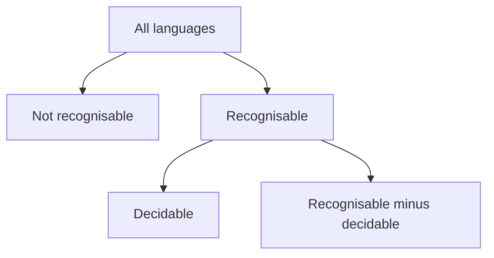

import { ConceptTemplate } from '@/features/kb/components/templates/ConceptTemplate'
import { Callout } from '@/features/kb/components/mdx/Callout'
import { ComparisonTable } from '@/features/kb/components/mdx/ComparisonTable'

export default function Layout({ children }) {
  return (
    <ConceptTemplate title="Computability">
      {children}
    </ConceptTemplate>
  )
}

**Computability** (recursion theory) draws the line between problems a Turing machine can solve and problems no algorithm can solve, no matter the hardware. It is the layer under complexity: first ask whether any finite procedure exists, then ask what it costs.

## 1. Deep Dive and Mechanics

A function f on naturals is **computable** if some TM, on input n, halts with f(n) on the tape. A language L is **decidable** if some TM halts on every input and accepts exactly the strings in L. L is **recognisable** (r.e., semi-decidable) if some TM accepts exactly L and may loop on the complement.

**Classic facts.** The halting set is recognisable but not decidable. The complement of the halting set is not even recognisable. Rice's theorem: any nontrivial semantic property of programs is undecidable.

**Reductions.** A many-one reduction from A to B shows A is no harder than B for computability. That is not the same as a poly-time reduction.

<Callout icon="warning" title="Infinite time is still finite each run">
Computable does not mean finishes this afternoon. A TM that runs a tower of exponentials is still a decision procedure. Feasibility is complexity, not computability.
</Callout>

## 2. Mathematical / Theoretical Foundation

The Church-Turing thesis identifies algorithm with TM or an equivalent model. Kleene's normal-form theorem: every computable function is a bounded search around a primitive recursive predicate.

The arithmetic hierarchy classifies languages by alternating unbounded quantifiers over a decidable matrix. Sigma-1 is the r.e. sets. Decidable sets are Delta-1.

<ComparisonTable
  headers={['Kind', 'Always halt?', 'On no-instances', 'Example']}
  rows={[
    ['Decidable', 'Yes', 'Reject and halt', 'Is this DFA empty?'],
    ['Recognisable only', 'No', 'May loop', 'Does this TM halt?'],
    ['Not recognisable', 'N/A', 'No TM accepts exactly it', 'Does this TM loop?'],
    ['Computable function', 'Yes, with output', 'Total function', 'Addition'],
  ]}
/>

## 3. Real-World Implementation

```python
# A computable decision procedure (even numbers)
def even(n):
    return n % 2 == 0

# A recogniser shape for search-for-a-witness
def recogniser(pred, start=0):
    n = start
    while True:
        if pred(n):
            return True
        n += 1
```

If pred is never true, recogniser loops. That is the difference between recognise and decide.

## 4. Visualizations



## 5. Interview Prep

**Q: Computable versus decidable?**
**A:** Computable usually describes functions. Decidable describes languages. They are the same idea: a TM that always finishes with the answer.

**Q: State Rice's theorem.**
**A:** Any property that depends only on the function a program computes, and that some programs have and some do not, is undecidable. "Does this program compute the zero function?" is undecidable.

**Q: Why can type checkers still work?**
**A:** They decide a conservative property of syntax or of a restricted language, not arbitrary semantic properties of Turing-complete programs.

## 6. Production Use Cases

- **Static analysis** uses conservative computable over-approximations of uncomputable questions.
- **CI systems** should not try to decide this job will finish; they use timeouts.
- **Smart-contract and kernel DSLs** sometimes restrict the language so more properties become decidable.

<Callout icon="tip" title="Name the reduction">
When you claim a feature is impossible, show that if you had it you could decide HALT. That is the standard engineering use of computability.
</Callout>
