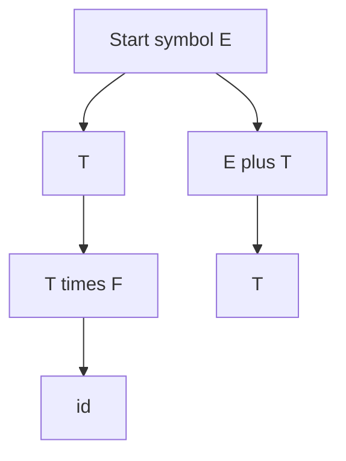

import { ConceptTemplate } from '@/features/kb/components/templates/ConceptTemplate'
import { Callout } from '@/features/kb/components/mdx/Callout'
import { ComparisonTable } from '@/features/kb/components/mdx/ComparisonTable'

export default function Layout({ children }) {
  return (
    <ConceptTemplate title="Context-Free Grammars">
      {children}
    </ConceptTemplate>
  )
}

A **context-free grammar** (CFG) generates a language by rewriting a start symbol using productions A -> alpha, where A is one nonterminal and alpha is any string of terminals and nonterminals. The rewrite does not look at the neighbours of A — that is the context-free part. Programming-language nesting (blocks, expressions, balanced delimiters) is the poster child.

## 1. Deep Dive and Mechanics

A CFG is a 4-tuple: terminals, nonterminals, productions, start symbol. A **derivation** replaces one nonterminal per step. The **parse tree** records which production was used at each node. If two trees exist for one string, the grammar is **ambiguous**.

**Normal forms.** Chomsky normal form (A -> BC or A -> a) feeds CYK. Greibach normal form feeds some top-down algorithms. Parser generators accept a wider syntax and compile to a deterministic subclass (LL, LALR).

**Limits.** The copy language a-n b-n c-n is not context-free. Cross-serial dependencies and regex-with-backreferences leave CFGs behind. Indentation-sensitive languages add a lexer-level stack.

<Callout icon="info" title="CFG versus the language">
Many grammars generate the same language. Parser writers pick the grammar that is unambiguous, deterministic, and maps onto a nice AST — not the smallest grammar.
</Callout>

## 2. Mathematical / Theoretical Foundation

The context-free languages are exactly the languages accepted by nondeterministic pushdown automata. They are closed under union, concatenation, and Kleene star, not under intersection or complement in general. The pumping lemma for CFLs is the usual non-membership proof.

Deterministic CFLs, accepted by deterministic PDAs, are a proper subclass and match what practical LR parsers want.

<ComparisonTable
  headers={['Device / grammar', 'Nesting memory', 'Example language', 'Parser']}
  rows={[
    ['Regular / DFA', 'None', 'a-star b-star', 'Lexer'],
    ['CFG / NPDA', 'One stack', 'balanced parens', 'Earley, CYK'],
    ['DCFL / DPDA', 'One stack, det.', 'typical code syntax', 'LL, LR'],
    ['CSG / LBA', 'Linear bound', 'a-n b-n c-n', 'Not used for syntax'],
  ]}
/>

## 3. Real-World Implementation

```text
# Expression CFG (ambiguous if + and * share one rule)
E -> E + E | E * E | ( E ) | id
# Unambiguous, precedence-encoded
E -> E + T | T
T -> T * F | F
F -> ( E ) | id
```

The second grammar makes * bind tighter and both operators left-associative — the usual arithmetic convention.

## 4. Visualizations



## 5. Interview Prep

**Q: Why are programming languages context-free plus a bit?**
**A:** Nesting is CFG. Typed names, typedef versus multiply in C++, and indentation are extra-contextual. The CFG does the syntax; semantic analysis and lexer hacks do the rest.

**Q: How do you prove a language is not context-free?**
**A:** Pumping lemma or closure: if L intersect a regular language is not CF, then L is not CF. a-n b-n c-n is the standard example.

**Q: Ambiguous grammar versus ambiguous language?**
**A:** A language is inherently ambiguous if every CFG for it is ambiguous. Most programming languages are designed not to be; the spec picks one tree.

## 6. Production Use Cases

- **Parser generators** (bison, ANTLR, lalrpop) take a CFG-like spec.
- **Natural language** partial parses; full English is not a clean CFL.
- **Protocol grammars** where nested structure appears (not just regular tokens).

<Callout icon="tip" title="Encode precedence in the grammar or the parser">
Do one or the other. A single E -> E op E rule plus precedence declarations in yacc is fine. Doing neither yields a bush of shift/reduce conflicts.
</Callout>
