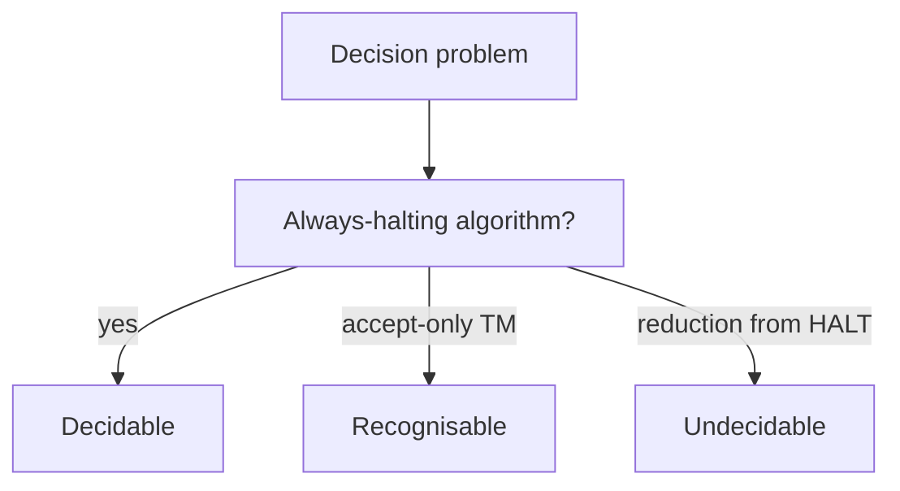

import { ConceptTemplate } from '@/features/kb/components/templates/ConceptTemplate'
import { Callout } from '@/features/kb/components/mdx/Callout'
import { ComparisonTable } from '@/features/kb/components/mdx/ComparisonTable'

export default function Layout({ children }) {
  return (
    <ConceptTemplate title="Decidability">
      {children}
    </ConceptTemplate>
  )
}

A language L is **decidable** (recursive) when there is a Turing machine that, on every input, halts and correctly answers membership. If the machine may loop on no-instances, L is only **semi-decidable**. Decidability is the question: can I ship a checker that always returns?

## 1. Deep Dive and Mechanics

**How we prove decidable.** Exhibit an algorithm that tries finitely many things. Emptiness of a DFA: search the reachable-state graph. Equivalence of DFAs: minimise both, compare.

**How we prove undecidable.** Reduce from a known undecidable language, usually HALT or A_TM. Rice's theorem gives a factory of undecidable "does this program's language have property P?" results.

**Borderline.** CFG emptiness is decidable; CFG universality is not. True regular expressions are decidable for almost every property you want; adding backreferences blows that up.

<Callout icon="info" title="Decidable does not mean cheap">
Presburger arithmetic is decidable and not primitive recursive in the worst case. There is a procedure is a very low bar for a product feature.
</Callout>

## 2. Mathematical / Theoretical Foundation

The decidable languages are closed under complement, union, and intersection: run both machines, they halt, combine the answers. Recognisable languages are not closed under complement.

If L and its complement are both recognisable, then L is decidable: dovetail both recognisers; one will halt.

<ComparisonTable
  headers={['Problem', 'Model', 'Decidable?', 'Why']}
  rows={[
    ['Emptiness', 'DFA', 'Yes', 'Graph reachability'],
    ['Equivalence', 'DFA', 'Yes', 'Minimise and compare'],
    ['Emptiness', 'CFG', 'Yes', 'Reachable productive vars'],
    ['Equivalence', 'CFG', 'No', 'Reduce from universality'],
    ['Halting', 'TM', 'No', 'Diagonal or reduction'],
  ]}
/>

## 3. Real-World Implementation

```python
# Decidable: DFA emptiness via BFS on the state graph
def dfa_empty(start, accept, delta):
    seen = set([start])
    queue = [start]
    while queue:
        s = queue.pop(0)
        if s in accept:
            return False
        for t in delta.get(s, {}).values():
            if t not in seen:
                seen.add(t)
                queue.append(t)
    return True
```

No TM simulation is required. The state set is finite, so BFS always finishes.

## 4. Visualizations



## 5. Interview Prep

**Q: Decidable versus recognisable?**
**A:** Decidable: always halt, yes or no. Recognisable: halt on yes, may loop on no. Complements of recognisable sets need not be recognisable.

**Q: Give one decidable and one undecidable compiler problem.**
**A:** Decidable: is this regex empty? Undecidable: do these two C programs compute the same function? (Rice).

**Q: Why is CFG equivalence undecidable but DFA equivalence easy?**
**A:** Two-stack or "two independent counts" phenomena appear in CFGs. Finite-state machines can be canonicalised; CFGs cannot.

## 6. Production Use Cases

- **Linters and type checkers** are designed to stay on the decidable side, even if that means incomplete.
- **Protocol validators** decide regular or simple CFG properties of messages.
- **CI policies** treat "will this job halt?" as undecidable and install a timeout.

<Callout icon="tip" title="Dovetailing is a real technique">
When you have a semi-decider for L and one for not-L, run them in round-robin. That is how some theorem provers search for a proof and a counter-model together.
</Callout>
