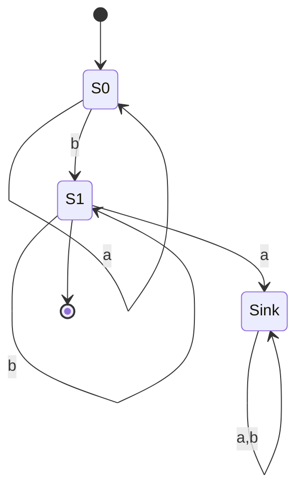

import { ConceptTemplate } from '@/features/kb/components/templates/ConceptTemplate'
import { Callout } from '@/features/kb/components/mdx/Callout'
import { ComparisonTable } from '@/features/kb/components/mdx/ComparisonTable'

export default function Layout({ children }) {
  return (
    <ConceptTemplate title="Finite Automata (DFA & NFA)">
      {children}
    </ConceptTemplate>
  )
}

A **finite automaton** reads a string one symbol at a time and accepts if it ends in an accepting state. A **DFA** has one transition per state and symbol. An **NFA** may have several, or epsilon-moves. They recognise exactly the regular languages. That is why lexers, network ACLs, and many protocol scanners are DFAs in disguise.

## 1. Deep Dive and Mechanics

The machine is a finite set of states, an alphabet, a transition relation, a start state, and accept states. On input w it walks the unique DFA path, or some NFA path. Accept if any path (NFA) or the path (DFA) ends accepting.

**Subset construction.** Every NFA has an equivalent DFA whose states are sets of NFA states. The DFA can be exponentially larger (the classic a-or-b then a then anything of length n-1 example). In practice lex and grep keep the NFA or build the DFA lazily.

**Minimisation.** Hopcroft's algorithm computes the unique smallest DFA for a language. Two DFAs are equivalent iff their minimised forms are isomorphic.

<Callout icon="info" title="No counting to n for arbitrary n">
A DFA cannot remember an unbounded integer. a-n b-n is not regular. If you need a count that grows with the input, you need a stack or a heap.
</Callout>

## 2. Mathematical / Theoretical Foundation

Kleene's theorem: regular expressions, NFAs, and DFAs all denote the same class. Myhill-Nerode: a language is regular iff the indistinguishability relation on prefixes has finitely many classes. That theorem also gives the size of the minimal DFA.

Closure: regular languages are closed under union, concat, star, complement (flip DFA accept bits), and intersection (product automaton).

<ComparisonTable
  headers={['Machine', 'Transition', 'Can be exponentially smaller?', 'Typical use']}
  rows={[
    ['DFA', 'Unique', 'It is the expanded form', 'Lexers, hardware'],
    ['NFA', 'Many / epsilon', 'Yes versus DFA', 'Regex compile'],
    ['e-NFA', 'Plus epsilon', 'Yes', 'Thompson construction'],
    ['PDA', 'Plus stack', 'N/A', 'Parsers, not lexers'],
  ]}
/>

## 3. Real-World Implementation

```python
def dfa_accept(start, accept, delta, text):
    s = start
    for ch in text:
        s = delta[s][ch]
    return s in accept

# DFA for a*b+
delta = {
    0: {'a': 0, 'b': 1},
    1: {'a': 2, 'b': 1},
    2: {'a': 2, 'b': 2},
}
print(dfa_accept(0, {1}, delta, 'aaab'))
print(dfa_accept(0, {1}, delta, 'aaa'))
```

State 2 is a sink for strings that fell out of a-star b-plus.

## 4. Visualizations



## 5. Interview Prep

**Q: Why convert NFA to DFA?**
**A:** Simulation of an NFA needs a set of states per character (or backtracking). A DFA is one state per character — faster, bigger. Engines pick based on the pattern.

**Q: How do you prove a language is not regular?**
**A:** Pumping lemma, or Myhill-Nerode (infinitely many distinct prefixes), or closure (intersect with a regular language, get a known non-regular).

**Q: Are finite automata useful if we have TMs?**
**A:** Yes. Decision problems about DFAs are easy (emptiness, equivalence). The same questions about TMs are undecidable. Use the weakest machine.

## 6. Production Use Cases

- **Compiler lexers** generated by flex/re2c or written as switch-on-char DFAs.
- **Intrusion detection and packet filters** that compile rule sets to automata.
- **Input validation** (email-shaped strings, token formats) — with the caveat that "real email" is not a clean regular language.

<Callout icon="warning" title="Catastrophic backtracking is an NFA-engine bug">
Some regex engines explore NFA paths with backtracking and can go exponential on crafted input. Prefer linear-time automata engines for untrusted patterns.
</Callout>
