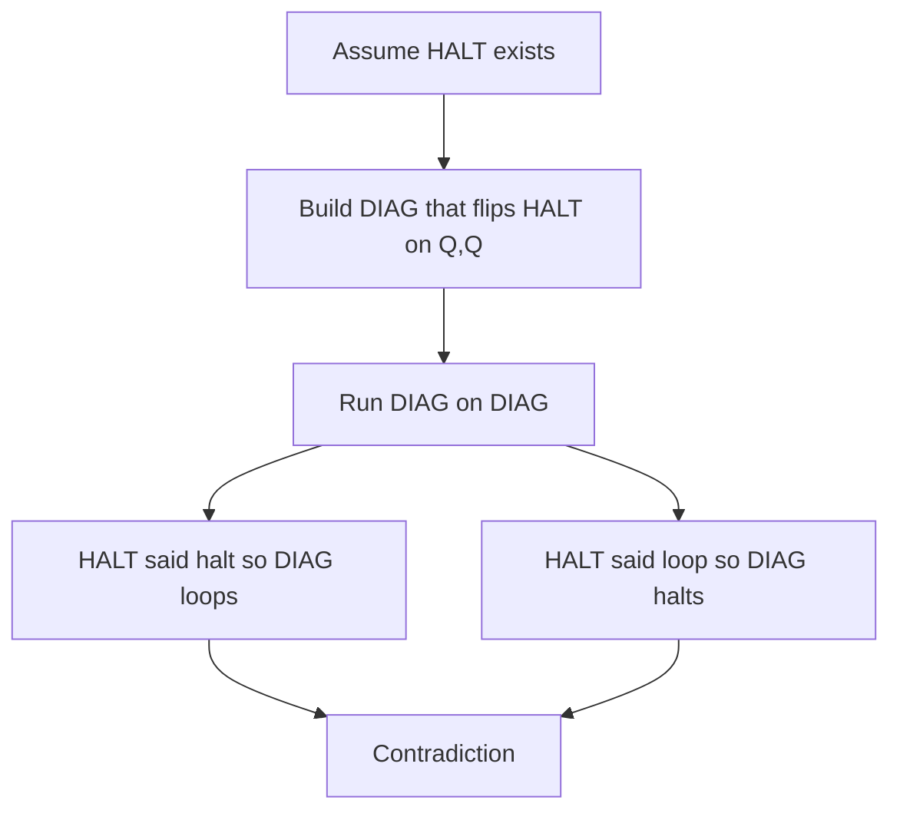

import { ConceptTemplate } from '@/features/kb/components/templates/ConceptTemplate'
import { Callout } from '@/features/kb/components/mdx/Callout'
import { ComparisonTable } from '@/features/kb/components/mdx/ComparisonTable'

export default function Layout({ children }) {
  return (
    <ConceptTemplate title="Halting Problem">
      {children}
    </ConceptTemplate>
  )
}

The **halting problem** asks: given a program P and an input x, does P halt on x? Turing showed that no algorithm answers this for every pair (P, x). It is the root reduction source for almost every "you cannot statically decide that" result in compilers and static analysis.

## 1. Deep Dive and Mechanics

Assume toward contradiction there is a decider HALT(P, x) that always returns true or false. Build a program DIAG that, on input Q, runs HALT(Q, Q) and then does the opposite: if HALT says Q halts on Q, DIAG loops; otherwise DIAG halts. Feed DIAG to itself. If HALT said DIAG-on-DIAG halts, DIAG loops, contradiction. If HALT said it loops, DIAG halts, contradiction. Therefore HALT does not exist.

**Recognisable, not decidable.** You can simulate P on x and accept if it ever stops. That recognises the halting set. It does not decide the complement: you will wait forever on a looper.

**Practical cousins.** "Will this CI job finish?", "does this template instantiation terminate?", "will this recursive type alias unfold?" are halt-shaped. Tools use timeouts, fuel, and restricted languages.

<Callout icon="warning" title="Special cases can still be decidable">
Halting for DFAs is trivial (no loops that depend on unbounded memory in the same way). Halting for programs that use only Presburger counters can be decidable. The theorem is about a Turing-complete encoding of all programs.
</Callout>

## 2. Mathematical / Theoretical Foundation

Let A_TM = pairs (M, w) such that TM M accepts w. A_TM is r.e.-complete. HALT (M eventually stops on w, accept or reject) is many-one equivalent to A_TM for standard encodings.

Rice's theorem generalises the idea: any nonempty proper subset of computable functions, asked as "does this program compute one of those?", is undecidable. Halting is the engine inside most proofs.

<ComparisonTable
  headers={['Problem', 'Decidable?', 'Recognisable?', 'Typical reduction']}
  rows={[
    ['HALT', 'No', 'Yes', 'Diagonalisation'],
    ['Complement of HALT', 'No', 'No', 'Closure of decidable'],
    ['A_TM', 'No', 'Yes', 'Simulate and accept'],
    ['DFA emptiness', 'Yes', 'Yes', 'Graph search'],
  ]}
/>

## 3. Real-World Implementation

```python
# A recogniser, not a decider: simulate with a step budget
def halts_within(fn, arg, fuel):
    # In a real TM simulator you count transitions.
    # Here we just refuse to be a decider.
    try:
        return fn(arg, fuel)
    except RecursionError:
        return False

def hungry(n, fuel):
    if fuel <= 0:
        raise RecursionError('fuel')
    return hungry(n, fuel - 1) if n < 0 else True
```

Raising fuel never yields a uniform decider. For any bound, a longer looper exists.

## 4. Visualizations



## 5. Interview Prep

**Q: Sketch the proof in four sentences.**
**A:** Suppose a halt decider exists. Write a program that asks the decider about itself and then does the opposite. Self-application contradicts both answers. Therefore the decider does not exist.

**Q: If it is undecidable, why do sanitisers exist?**
**A:** They answer a different question: "I can prove it loops" or "I can prove it is safe," and otherwise say "unknown." Incomplete + sound is allowed. Complete + always-halt on all programs is not.

**Q: Does a timeout solve the halting problem?**
**A:** No. A timeout solves a resource-bounded problem (halts within T steps). That is decidable and not the same set.

## 6. Production Use Cases

- **Compiler termination** of macros, templates, and constexpr: fuel counters and recursion limits.
- **Static analysers** that never promise a yes/no on arbitrary loops.
- **Workflow engines** that treat "this human task will complete" as outside the algorithm.

<Callout icon="tip" title="Use HALT as a reduction source">
To show "will this optimiser terminate on all IR?" is undecidable, encode a TM into IR and ask whether a pass that simulates it returns. That is the usual paper pattern.
</Callout>
