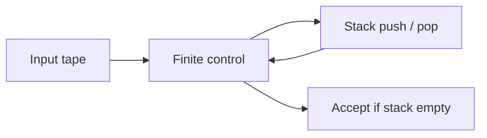

import { ConceptTemplate } from '@/features/kb/components/templates/ConceptTemplate'
import { Callout } from '@/features/kb/components/mdx/Callout'
import { ComparisonTable } from '@/features/kb/components/mdx/ComparisonTable'

export default function Layout({ children }) {
  return (
    <ConceptTemplate title="Pushdown Automata">
      {children}
    </ConceptTemplate>
  )
}

A **pushdown automaton** (PDA) is a finite-state machine with an unbounded stack. On each input symbol (or on epsilon) it can push, pop, or replace the top of the stack and change state. Nondeterministic PDAs accept exactly the context-free languages. That is the machine-model reason parsers can handle nested brackets.

## 1. Deep Dive and Mechanics

A move is specified by current state, next input (or epsilon), and current top-of-stack. The instruction writes a (possibly empty) string of stack symbols and a next state. Acceptance is usually by empty stack, or by accept state, equivalently.

**Deterministic PDAs** (DPDA) are weaker. They match deterministic CFLs, the family LR parsers inhabit. Palindromes over a two-letter alphabet need nondeterminism (guess the middle).

**Why one stack.** Two stacks are already Turing-complete (they can simulate a TM tape). One stack can compare one nested or matched count (a-n b-n) but not two independent counts (a-n b-n c-n).

<Callout icon="info" title="The parse stack is a PDA">
Shift-reduce parsers are DPDAs: the stack holds states (and symbols), the input is tokens, reduce is a burst of pops plus a goto push. Recursive descent uses the call stack the same way.
</Callout>

## 2. Mathematical / Theoretical Foundation

CFG-to-PDA: the PDA guesses a leftmost derivation, pushing right-hand sides and matching terminals to the input. PDA-to-CFG: variables encode pairs of PDA states (entry, exit) that empty a stack symbol — the classic triple construction.

Pumping for CFLs follows from long paths in parse trees (or from stack height repeating). Closure: CFLs are not closed under complement or intersection; the intersection of two CFLs can be a-n b-n c-n.

<ComparisonTable
  headers={['Machine', 'Extra memory', 'Languages', 'Deterministic = nondet?']}
  rows={[
    ['DFA', 'None', 'Regular', 'Yes'],
    ['DPDA', 'One stack', 'DCFL', 'No, NPDA is bigger'],
    ['NPDA', 'One stack', 'CFL', 'Nondet is essential'],
    ['Two-stack / TM', 'Two stacks or tape', 'RE / computable', 'Nondet does not add more functions'],
  ]}
/>

## 3. Real-World Implementation

```python
def pda_anbn(s):
    stack = []
    phase = 'a'
    for ch in s:
        if ch == 'a' and phase == 'a':
            stack.append('A')
        elif ch == 'b' and stack:
            phase = 'b'
            stack.pop()
        else:
            return False
    return phase == 'b' and not stack

print(pda_anbn('aaabbb'), pda_anbn('aaabb'))
```

This DPDA accepts a-n b-n for n at least 1. It cannot be extended to also demand c-n with only one stack.

## 4. Visualizations



## 5. Interview Prep

**Q: Why can a parser handle nested XML but not a-n b-n c-n in the grammar alone?**
**A:** Nesting is one stack. Three independent equal counts need two comparisons. You can check the third count in a later semantic pass, which is extra-contextual.

**Q: PDA versus TM?**
**A:** A PDA's only memory is a stack (LIFO). A TM can move either way on a tape. Two stacks simulate a tape.

**Q: Empty-stack versus accept-state?**
**A:** Equivalent for NPDAs. Some textbook constructions prefer one or the other. DPDAs are more sensitive to the acceptance mode.

## 6. Production Use Cases

- **LR and LL parsers** as engineered DPDAs with a token lookahead.
- **HTML/XML well-formedness** (and JSON brace matching) as stack walks.
- **Call-stack thinking** in language VMs: each call is a push, each return a pop — a PDA if you ignore the heap.

<Callout icon="tip" title="If you need two stacks, you need a TM">
A feature that matches two independent nested structures at once is a red flag that a pure CFG/PDA frontend will not suffice.
</Callout>
