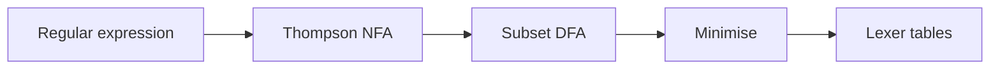

import { ConceptTemplate } from '@/features/kb/components/templates/ConceptTemplate'
import { Callout } from '@/features/kb/components/mdx/Callout'
import { ComparisonTable } from '@/features/kb/components/mdx/ComparisonTable'

export default function Layout({ children }) {
  return (
    <ConceptTemplate title="Regular Languages">
      {children}
    </ConceptTemplate>
  )
}

A **regular language** is a set of strings accepted by some DFA (equivalently, some NFA, equivalently, some regular expression). It is the smallest, best-behaved class in the Chomsky hierarchy. Compilers put the lexer here on purpose: tokenisation should be a linear scan with a finite amount of memory.

## 1. Deep Dive and Mechanics

Start from finite languages (any finite set is regular) and close under union, concatenation, and Kleene star — that is Kleene's original definition. DFAs give a machine view. Regular expressions give a notation view. They match.

**What is not regular.** a-n b-n, balanced parentheses of unbounded depth, and "the language of all palindromes" over a two-letter alphabet. If recognition needs an unbounded counter or a stack, it is past regular.

**Engineering regex versus math regex.** PCRE backreferences and lookaround are not regular. They can encode NP-hard matching and non-regular languages. A lexer should not use that dialect.

<Callout icon="warning" title="Star height and evil patterns">
Even true regular languages can have huge DFAs. And backtracking engines can take exponential time on a regular pattern. Linear-time automata matching is the safe default for untrusted input.
</Callout>

## 2. Mathematical / Theoretical Foundation

Myhill-Nerode: L is regular iff the relation "x and y have the same accepting continuations" has finitely many classes. The number of classes is the number of states in the minimal DFA.

Pumping lemma: every long enough word in a regular L splits as xyz with xy-k z still in L for all k. Use the contrapositive to prove non-regularity. It is necessary, not always sufficient — some non-regular languages still pump.

Decidability is excellent: emptiness, finiteness, equivalence, and inclusion are all decidable for DFAs.

<ComparisonTable
  headers={['Notation', 'Power', 'Decidable equivalence?', 'Use']}
  rows={[
    ['Math regex / DFA', 'Regular', 'Yes', 'Lexers, protocols'],
    ['PCRE-like regex', 'More than regular', 'No in general', 'Ad-hoc validation'],
    ['CFG', 'CFL', 'No', 'Parsers'],
    ['TM', 'RE languages', 'No', 'General programs'],
  ]}
/>

## 3. Real-World Implementation

```python
import re

# A true regular token: identifiers
IDENT = re.compile(r'^[A-Za-z_][A-Za-z0-9_]*$')
print(bool(IDENT.match('foo_42')), bool(IDENT.match('12bad')))

# Not regular if you mean "same ident twice" with a backreference
# r'^(a+)\1$' is not a regular language for arbitrary copies
```

In the lexer, compile the union of token regexes to one DFA with a priority rule per accept state.

## 4. Visualizations



## 5. Interview Prep

**Q: Are all finite languages regular?**
**A:** Yes. Build a trie-like DFA, or write a giant union of the words. Infinite languages may or may not be regular.

**Q: Why can't a regex parse HTML?**
**A:** HTML (even a toy tag-nesting fragment) needs a stack. Regular languages cannot enforce unbounded matching close-tags. Use a parser.

**Q: What does Myhill-Nerode buy you that pumping does not?**
**A:** An exact characterisation and the size of the minimal DFA. Pumping only kills some non-regular candidates.

## 6. Production Use Cases

- **Lexers** and syntax highlighters.
- **Network and log scanners** compiled to DFA (RE2, Hyperscan).
- **Protocol state machines** that must stay finite-state for model checking.

<Callout icon="tip" title="Prefer RE2-style engines at the edge">
Google RE2 and similar libraries refuse backreferences and guarantee linear time. That is the regular-language contract enforced in code.
</Callout>
