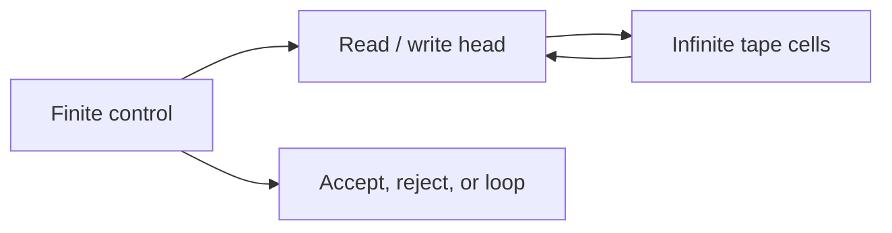

import { ConceptTemplate } from '@/features/kb/components/templates/ConceptTemplate'
import { Callout } from '@/features/kb/components/mdx/Callout'
import { ComparisonTable } from '@/features/kb/components/mdx/ComparisonTable'

export default function Layout({ children }) {
  return (
    <ConceptTemplate title="Turing Machines">
      {children}
    </ConceptTemplate>
  )
}

A **Turing machine** (TM) is a finite-state controller with a read/write head on an infinite tape of cells. At each step it reads a symbol, writes a symbol, moves left or right, and changes state. Turing introduced it in 1936 as a model of a human computer. It is still the default definition of "what an algorithm can do."

## 1. Deep Dive and Mechanics

A TM is a finite tuple: states, tape alphabet (including blank), input alphabet, transition function, start state, accept state, reject state. A **configuration** is (state, tape contents, head position). A run is a sequence of configurations. It may halt and accept, halt and reject, or run forever.

**Variants that do not change power.** Multi-tape, multi-head, two-way infinite tape, nondeterministic TMs (same computable functions; nondeterminism does change time classes). A RAM with unbounded addresses is equivalent up to polynomial time under standard encodings.

**Turing completeness.** A language or system is Turing complete if it can simulate a universal TM. Universal TMs take a description of M and an input w and simulate M on w — a stored-program computer.

<Callout icon="info" title="Infinite tape is a mathematical courtesy">
Every halting run uses only finitely many cells. The infinity means you do not have to declare a bound in advance. Real machines fail when they OOM; the TM would have asked for another cell.
</Callout>

## 2. Mathematical / Theoretical Foundation

The computable functions are those computed by some TM that always halts with the answer. The recognisable languages are those for which some TM accepts exactly the members (and may loop otherwise).

A universal TM U satisfies U(code(M), w) behaves like M(w). Existence of U plus diagonalisation yields the undecidability of the halting problem.

<ComparisonTable
  headers={['Model', 'Memory', 'Computes same functions?', 'Changes complexity?']}
  rows={[
    ['Single-tape TM', 'One tape', 'Yes, by definition', 'Baseline'],
    ['Multi-tape TM', 'Several tapes', 'Yes', 'Yes, often quadratic'],
    ['Nondeterministic TM', 'Tape + guesses', 'Yes for functions', 'Yes: NP vs P'],
    ['PDA', 'Stack only', 'No', 'Weaker class'],
  ]}
/>

## 3. Real-World Implementation

```python
# Tiny TM: increment a unary number 111 -> 1111, blank is '_'
# states: s (scan right), w (write one), halt
TRANS = {
    ('s', '1'): ('s', '1', 1),
    ('s', '_'): ('halt', '1', 0),
}

def run_tm(tape, start='s', max_steps=1000):
    tape = list(tape) + ['_']
    head, state, steps = 0, start, 0
    while state != 'halt' and steps < max_steps:
        key = (state, tape[head])
        if key not in TRANS:
            return ''.join(tape), state
        state, write, move = TRANS[key]
        tape[head] = write
        head = max(0, head + move)
        if head >= len(tape):
            tape.append('_')
        steps += 1
    return ''.join(tape).rstrip('_'), state

print(run_tm('111'))
```

## 4. Visualizations



## 5. Interview Prep

**Q: Why is a TM the definition of algorithm?**
**A:** Because every other reasonable model has been proved equivalent (Church-Turing thesis), and because the transition table is finite and fully explicit.

**Q: What is a universal TM?**
**A:** A single machine that takes an encoding of any other machine plus an input and simulates it. That is the theory of an interpreter, and of a stored-program CPU.

**Q: Turing complete versus useful?**
**A:** HTML is not Turing complete and is useful. C++ templates are Turing complete and that is a problem for compile-time termination. Completeness is power, not quality.

## 6. Production Use Cases

- **Semantics of languages and IR** are often given as abstract machines in the TM family (small-step).
- **Complexity** defines P, NP, PSPACE on TMs first, then claims robustness.
- **Accidental TMs** in configs, macros, and type systems — treat them as unbounded loops until proven otherwise.

<Callout icon="tip" title="Simulate with fuel">
Every practical TM simulator is a recogniser with a step cap. That is honest: you implemented HALT-within-T, not HALT.
</Callout>
